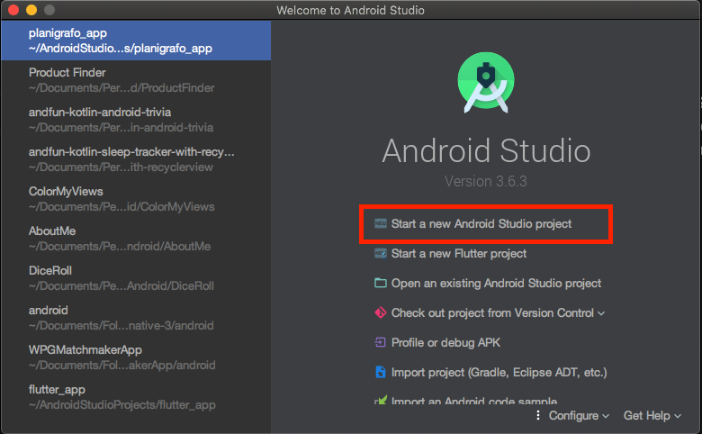
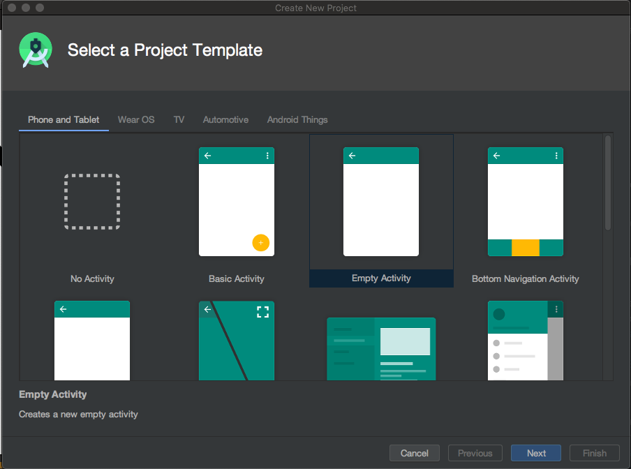
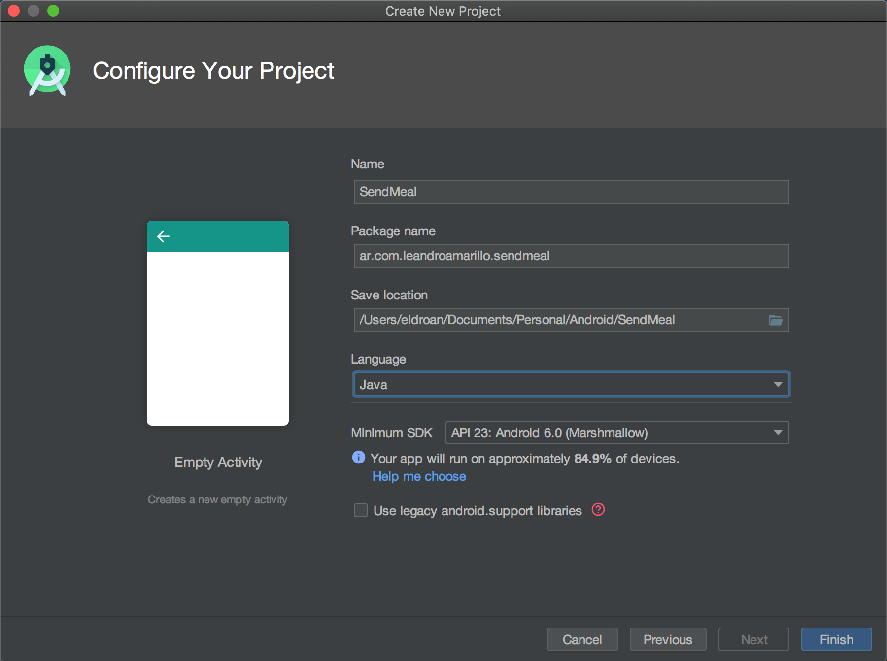
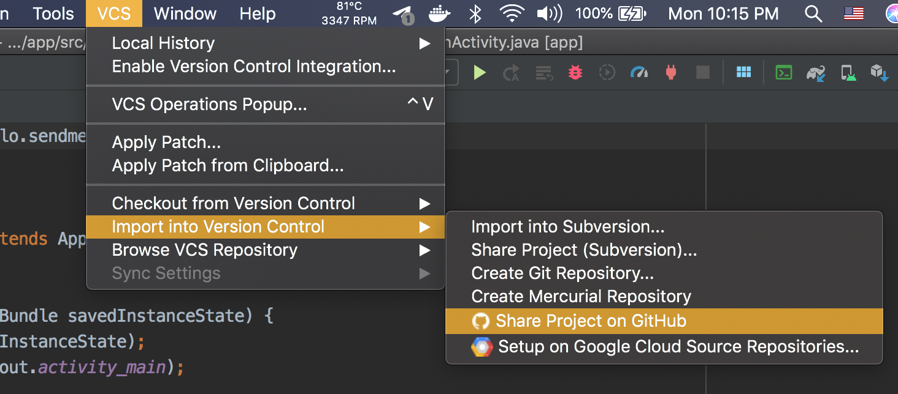
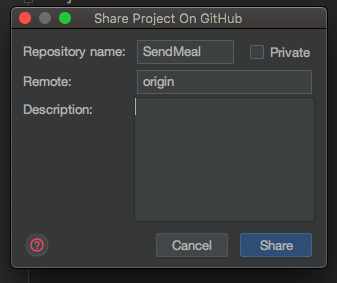
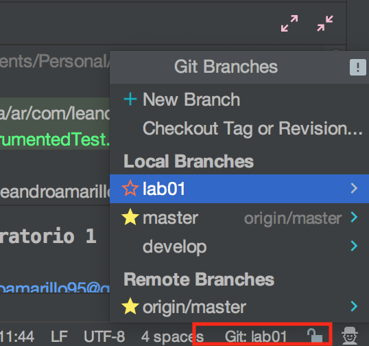
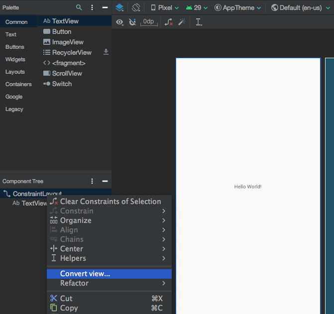

# Trabajo práctico integrador - Laboratorio 1

## Objetivos

- Familiarizarse con Android Studio
- Aprender a configurar control de versiones con GIT
- Utilizar los distintos componentes gráfico disponibles para implementar un formulario

## Tareas a desarrollar

### 1. Crear el proyecto

1. Abrir android studio y seleccionar la opcion para comenzar un nuevo proyecto.
   
2. Seleccionar `Empty Activity` como template
   
3. En la sección de configuración de proyecto seleccione.

   - Seleccione `JAVA` como lenguaje
   - Nombre de la aplicacion `Send Meal`
   - Nombre del paquete (Puede utilizar un nombre que identifique a su grupo)
   - Seleccionar el Minimun SDK (Se recomienda API 23, como mínimo elija el API correspondiente a su dispositivo para poder ejecutar la aplicación)

   > Asegúrese de haber seleccionado Java como lenguaje ya que Android Studio en sus versiones más recientes pre-selecciona Kotlin.

   

### 2. Configurar GIT

1. Es necesario tener una cuenta de Github, en caso de no tenerla puede registra una en [https://github.com](https://github.com)
2. Desde Android Studio, en la barra superior de tareas seleccione la opcion VCS → Import into Version Control → Share Project on Github
   
3. Asignamos el nombre de nuestro repositorio en Github bajo `Repository Name` asegurandonos que la opcion `Private` se encuentre des-marcada y presionamos `Share`.

   

   > Es necesario que el repositorio sea publico para poder realizar la correción de los trabajos prácticos. Para usos personales puede utilizar repositorios privados, los cuales solo pueden ser visualizados con la autorización del creador.

   > El campo `Remote` es el nombre con el cual git identificará localmente a este nuevo repositorio remoto en Github, es recomendado dejar el nombre `origin` ya que es la convención para los casos con un único repositorio remoto como el nuestro.

4. Para finalizar con la creación de nuestro repositorio debemos inicializarlo con un primer commit, la siguiente ventana de Android Studio nos presenta la opcion de agregar todos los archivos al seguimiento de GIT. Colocamos como mensaje para nuestro primer commit

   ```
   Iniciación del laboratorio 1
   ```

   Y luego presionamos `Add`

   

   > Recordemos que git solo realiza seguimiento de los archivos que le nosotros le indicamos o `tracked`, los que no, apareceran como `untracked`.

   > Apretar el boton `Add` en Android Studio para inicializar el repositorio realizo 2 acciones, primero realizo un `commit` a nuestro repositorio local y luego realizo un `push` al repositorio remoto en Github.

5. Verificar información en Github. La url del repositorio suele seguir la forma
   ```
   https://github.com/{USUARIO}/{NOMBRE_REPOSITORIO}
   ```
   

6. Crear la rama/branch `develop`, haciendo click con el IDE (Android Studio) en la barra inferior del margen derecho.


7. Crear una nueva rama con el nombre `lab01`.

    > Asegurarse de que se encuentre trabajando en la rama lab01 para la realizacion del laboratorio 1.

### 3. Configurar UI - (LinearLayout)
1. Para asegurarse que todo se encuentre funcionando correctamente probemos correr la aplicación generada presionando el boton verde con una flecha. Una vez que cargue deberíamos ver el mensaje 'Hello World' en pantalla

2. El mensaje 'Hello World!' que podemos observar se encuentra en la carpeta 'res' → 'layout' → 'activity_main.xml'. Para la realizacion del laboratorio utilizaremos un `LinearLayout` de orientación vertical pero el archivo 'activity_main.xml' fue autogenerado utilizando un `ConstrainLayout` por lo que tendremos que cambiarlo
    1. Abra 'activity_main.xml' y asegurese de tener seleccionada la opción `design`.
    
    2. Seleccione la `ContraintLayout` en el arbol de componentes y presione 'Convert view...' y seleccione `LinearLayout`
    
    
    3. Por default el `LinearLayout` coloca los elementos de forma horizontal. Para cambiar este comportamiento realizamos click → LinearLayout → Convert orientation to vertical
    

### 4. UI Propuesta

Se plantea realizar la pantalla de registro de usuarios la app, esta pantalla cuenta con gran cantidad de inputs y deberá reaccionar al estado de los inputs (ej: no dejar registrar al usuario si faltan campos por completar)

//TODO: Capturas del resultado final!!!!

#### Consideraciones
* Al rotar la pantalla del celular no se deberán perder los contenidos de los inputs
    * [https://developer.android.com/guide/components/activities/activity-lifecycle#saras](https://developer.android.com/guide/components/activities/activity-lifecycle#saras)
* Para el armado de la interface, no deberá usar texto directo, sino que deberá escribir todos los String en el archivo strings.xml 
* Los colores personalizadores deberan ser creados en el archivo colors.xml
* Crear en el directorio res/values el archivos dimensiones.xml ( click en el menú “File” → New → Values Resource File ) para almacenar los tamaños de elementos y fuentes


#### Elementos
* El nombre y el apellido como inputs de tipo `plain text`
* El correo electronico como campo de tipo `e-mail`
* Los inputs de clave y repetir clave deberan oscurecer la contraseña (tipo `password`) y deben ser iguales para que se considere valido
* El numero de tarjeta debe ser un input `numerico`
* El numero CCV de la tarjeta es un input `numerico` el cual estara visible pero deshabilitado si el numero de la tarjeta esta vacio
* El mes y año de vencimiento como dos dropdown (`spinner`), igual que el CCV solo editar si se ha completado el numero de tarjeta.
    * [https://developer.android.com/guide/topics/ui/controls/spinner](https://developer.android.com/guide/topics/ui/controls/spinner)
    * Solo es necesario cargar un par de años para mostrar la funcionalidad

* El tipo de tarjeta puede ser 'debito' o 'credito' seleccionando una de las dos opciones a través de un `RadioGroup`
* Un slider (`seekbar`) para que el usuario el monto de dinero inicial que desea cargar (valores entre 0 y 1500).
    * [https://developer.android.com/reference/android/widget/SeekBar](https://developer.android.com/reference/android/widget/SeekBar)
    * [https://www.geeksforgeeks.org/android-creating-a-seekbar/](https://www.geeksforgeeks.org/android-creating-a-seekbar/)
* Usar un switch button con la leyenda 'Realizar una carga inicial' que controle la visibilidad del slider que define el monto.
    * Para esto escuchar el evento de cambio en el botón. Si el botón está activado entonces mostrar los elementos de la cuenta usando el atributo visibility que puede tomar dos valores, `gone` (sale el elemento de la vista), y `visible` el elmento se muestra en la vista.
    
        En XML:
        ```xml
        android:visibility="gone"
        ```
         En listener de eventos usar:
        ```java
        slider.setVisibility(View.GONE) 
        ```
* Utilizar un checkbox para aceptar términos y condiciones.
    * Aquí también deberá capturar el evento de chequeado o no chequeado
* Finalmente un boton de 'Registrar', este se habilita si y solo si, se aceptan los términos y condiciones.

#### Validaciones
1. Los siguientes datos son obligatorios:
    * Correo electrónico
    * Clave
    * Tarjeta de Credito
    * Tipo de tarjeta
    * CCV
    * Fecha de vencimiento de tarjeta
2. Si se activo 'Realizar una carga inicial' el monto del slider debe ser mayor a 0 pesos
3. Verificar si coinciden las claves
4. Verificar que el correo electrónico tenga al menos una @ y 3 letras luego de la arroba
5. Verificar que si ingresó una tarjeta de crédito la fecha de vencimiento por lo menos sea superior a los próximos 3 meses
6. Cualquier condición de las anteriores que no se cumpla deberá mostrar un mensaje con el toast notificando al usuario. Si todas las validaciones son cumplidas notificar al usuario utilizando un toast con un mensaje de exito.


