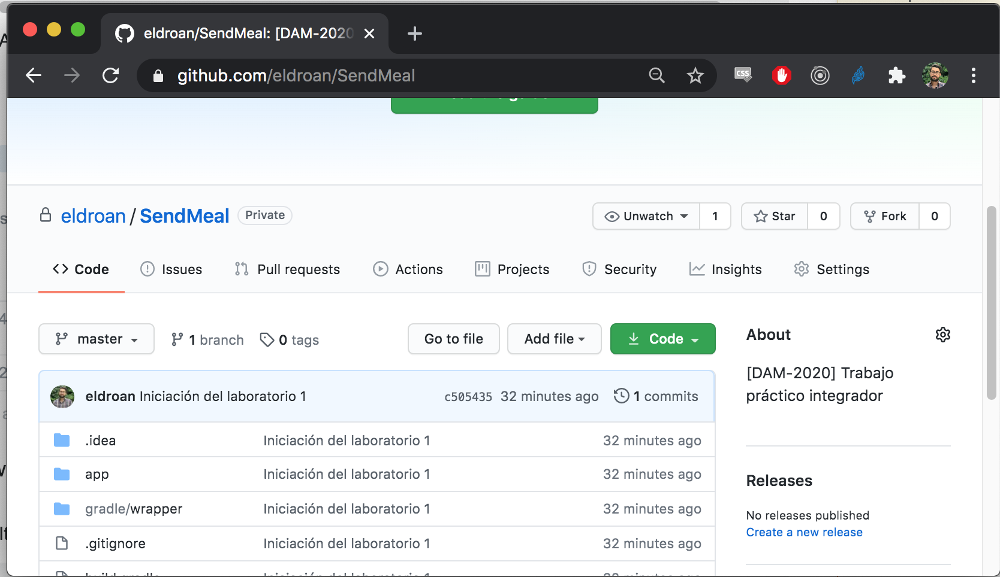
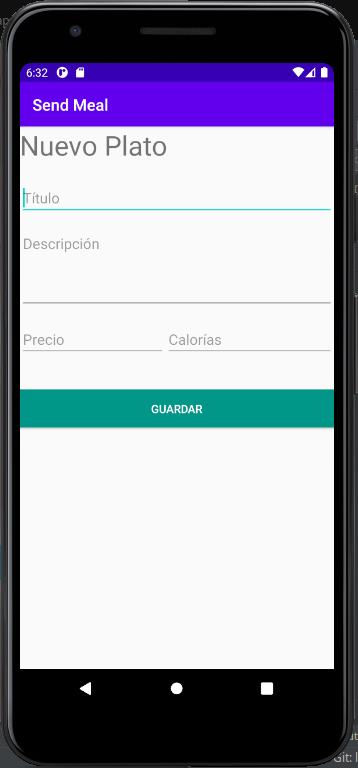

# Trabajo práctico integrador - Laboratorio 2

## Objetivos

- Utilizar Intent explícitos y gestionar actividades
- Usar widgets de listas (RecyclerView)
- Usar una ActionBar
- Usar adaptadores personalizados
- Utilizar Git en diversas ramas

## Tareas a desarrollar

### 1. Clonar el proyecto realizado en el laboratorio anterior 
######(De no tenerlo ya de manera local) 

   

De esta manera ahora tiene una copia del proyecto en su repositorio local. A continuación abrir el proyecto en Android Studio y hacer un checkout de la branch develop. 

A partir de develop, crear una nueva branch llamada lab02. Esta es la branch sobre la cual se realizrá el taller 2.  

Consultar el tutorial presentado en el taller 1 ante cualquier duda. 

### 2. Agregar una actividad Home y una ToolBar

Cambiar el estilo de la aplicación para que use un tema _NoActionBar_. Luego, crear una nueva actividad denominada “Home” que solo tenga un _textview_ con un mensaje de bienvenida. 

Para que la nueva Activity Home, sea lo primero que el usuario vea, se debe editar el  `AndroidManifest.xml` aclarando este cambio de comportamiento:
```
<activity android:name=".HomeActivity">
    <intent-filter>
        <action android:name="android.intent.action.MAIN" />
        <category android:name="android.intent.category.LAUNCHER" />
    </intent-filter>
</activity>
```

Agregar a esta pantalla home una _Toolbar_ que tendrá 3 opciones 

- Registrarme (la actividad creada en el laboratorio 01) 
- Crear Item ( actividad a crear en el paso 3) 
- Lista de Items (actividad a crear en el paso 4) 

Cada una de estas opciones deberá lanzar un Intent explícito que lance la actividad correspondiente.  

Luego el resto de las actividades tendrán una toolbar que solo permiten volver al paso anterior.

Para agregar la ToolBar ( `androidx.appcompat.widget.Toolbar `) se debe para cada actividad :
- Definir una toolbar y agregar las opciones de menú. 
- Agregar en build.gradle de modulo 

        implementation 'androidx.appcompat:appcompat:1.1.0

### 3. Crear actividad para dar de alta un nuevo plato. 

En esta actividad, el usuario deberá poder ingresar los datos necesarios para el alta de un plato. 

Estos datos son: 
- Título (String) 
- Descripción (String) 
- Precio (Double) 
- Calorías (Integer) 

Validar el ingreso correcto de dichos datos y definir los textos necesarios en el archivo de recursos para que no existan textos hardcodeados.  

El layout empleado para este formulario queda a elección del desarrollador, pudiéndose utilizar el layout sugerido.



Al presionar el botón “Guardar”, se debe crear una nueva instancia de Plato, para lo cual previamente deberá definir la clase Plato, junto con su constructor, getters y setters.

### 4. Crear actividad para ver lista de platos 

Crear una actividad que permita visualizar la lista de platos ofrecidos. 

Para esto, deberá utilizar de manera obligatoria un _RecyclerView_ utilizando el patrón _ViewHolder_. 

Deberá mostrar la lista de platos, donde para cada entrada se muestre:   
- Una imagen del plato (En esta instancia será la misma para todos los platos) 
- El título del plato 
- El precio del plato 

Para ello, realizar las siguientes acciones: 

- Crear un nuevo layout llamado `fila_plato.xml`. El layout que se utilice para la distribución de estos datos, queda a elección del desarrollador.  
- Se puede utilizar un  [CardView](https://developer.android.com/guide/topics/ui/layout/cardview) para lograr una apariencia más elegante. 
- Se puede utilizar un _LinearLayout_ o _ConstraintLayout_ con menor complejidad. 
- Crear una clase _PlatoViewHolder_ que tenga punteros a los elementos de la interface gráfica del layout creado. Esta clase debe extender de `RecyclerView.ViewHolder` 
- Crear el adaptador que represente la lista de platos. Esta clase debe extender de `RecyclerView.Adapter<PlatoViewHolder> `

Para usar el _Recycler_ ( y eventualmente el _CardView_) agregar como dependencia:
 ```
implementation 'androidx.constraintlayout:constraintlayout:1.1.3' 
implementation 'androidx.recyclerview:recyclerview:1.0.0' 
implementation 'androidx.cardview:cardview:1.0.0' 
```
#### Ejemplo de Lista


### Entrega del Trabajo. 

Al finalizar el trabajo práctico realizar un “Merge” de la rama “lab02” a la rama “develop” (el trabajo práctico se corregirá en la rama develop). 