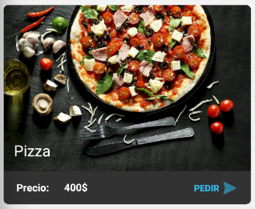

# Trabajo práctico integrador - Laboratorio 3
> Fecha de entrega para el laboratoratorio 3: 9 de octubre 2020

## Objetivos
- Enviar objetos parcelables entre activities
- Aprender a realizar tareas en background mediante AsyncTask
- Utilizar broadcast receiver y notificaciones locales

## Tareas a desarrollar

### 1. Crear un nuevo branch lab03 
###### (Suponemos que ya se tiene el repositorio de manera local) 

Partiendo del branch del laboratorio anterior;

* Abrimos una consola en la carpeta del proyecto 
* `git checkout develop` - Ahora que estamos en el branch develop
* `git merge <branchLabAnterior>`
* `git status` - Deberíamos ver que estamos X cantidad de commints más adelante que _origin/develop_
* `git push` - Para dejar actualizado _origin/develop_ con el nuevo merge
* `git checkout -b <branchLabNuevo>` - Estamos listos para arrancar el nuevo laboratorio

### 2. Crear actividad para nuevo pedido

Partiendo de la actividad para listar platos que realizamos en el laboratorio 2, en la toolbar, agregar la opción "Nuevo Pedido" que al ser presionado te llevará a una nueva Activity "PedidoActivity".

PedidoActivity le permitirá a los usuarios cargar un nuevo pedido, pudiendo crear una lista de platos que desean encargar.

Los datos que nos interesa guardar de un pedido son:

- El correo electronico del usuario.
- La direccion para el envio.
- Si tipo del pedido es para Envio o TakeAway.
- La lista de platos a encargar.

Esta activity contará con un formulario para ingresar los datos de interes y boton de "Agregar platos" que nos llevara a la activity del listado de platos, donde el usuario podra seleccionar uno de los platos existentes y "PedidoActivity" recibira el resultado de esta selección. ([_startActivityForResult_](https://developer.android.com/reference/android/app/Activity?hl=es-419#startActivityForResult(android.content.Intent,%20int)))

Para esto será necesario agregar al recycler un botón de "Pedir" que al ser apretado realice la accion de regresar con el plato seleccionado. Este boton, solo debe mostrarse cuando se viene desde "PedidoActivity".



Además, la actividad de creación de pedidos contará con un listado que mostrará el nombre de los platos incluidos y un detalle mostrando la cantidad de productos en la orden y el precio total.

Finalmente, la activity contara con un boton "Confirmar Pedido" cuya funcionalidad implementaremos posteriormente

### 3. Implementar lógica del boton Confirmar pedido usando Async Tasks

El botón "Confirmar Pedido" al ser presionado ejecutara una [Async Task](https://developer.android.com/reference/android/os/AsyncTask) que simulará el guardado del nuevo pedido, para esto la tarea esperará 5 segundos en el background antes de finalizar y enviar un mensaje de broadcast para crear una notificacion de android.

```
@Override
protected String doInBackground(String... params) { 
    //...
    Thread.sleep(time);
    //...
}

@Override
protected void onPostExecute(String result) {

    Intent notificationIntent = new Intent(this, MyNotificationPublisher.class);
    // ...
    alarmManager.set( ... );
}
```
### 4. Implementar un Broadcast Receiver para crear notificaciones

Queremos mostrarle al usuario una notificación con un texto que muestre que su pedido se ha creado correctamente, para esto primero generarmos un [broadcast](https://developer.android.com/guide/components/broadcasts) receiver que sea el encargado escuchar el aviso de la async task del punto anterior y crear las notificaciones en el dispositivo de manera local. 

Para crear un broadcast necesitamos nuestra propia clase que extienda de la clase abstracta BroadcastReceiver 

```
public class MyNotificationPublisher extends BroadcastReceiver {

    @Override
    public void onReceive (Context context , Intent intent) {
        // Logica para generar la notificación al recibier el broadcast...
    }
}
```

Para generar una notificación podemos apoyarnos en la documentación de google de [notificaciones](https://developer.android.com/training/notify-user/build-notification#java)

> En las versiones de android desde la 8.0 en adelante es necesario crear un notification channel antes de poder enviar una notificación.

