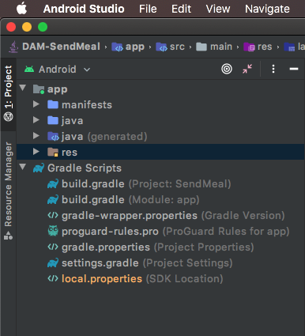
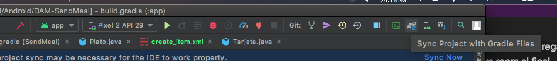

# Trabajo práctico integrador - Laboratorio 3

## Objetivos
- Persistir datos de nuestras aplicaciones mobile (online y offline)
- Utilizar ROOM para lograr la persistencia en el device
- Utilizar Retrofit para persistir datos online usando APIs REST
- Familiarizarnos con firebase como herramienta de backend enlatado


## Intro
Hasta ahora todas nuestras aplicaciones no manejaban datos o solo se almacenaban en memoria, perdiendose al momento de cerrar la app.

Una app suele requerir de algún mecanismo que le permita persistir datos, estos datos deber guardarse en algún lugar que este fuera del ciclo de vida de una app, ya sea dentro del mismo dispositivo (perdiendolos si el usuario decide utilizar otro o borra la app) o en algun servidor en internet a travez de servicios (como una api rest).

En este trabajo utilizaremos ambas opciones, localmente guardaremos los datos en una base de datos SQL utilizando Room y además utilizaremos Firebase, una plataforma de desarrollo de aplicaciones de Google, la cual entre sus servicios nos provee una forma sencilla persistir colleciones de JSONs a travez de una API REST.

### 1. Clonar el proyecto realizado en el laboratorio anterior

###### (De no tenerlo ya de manera local) 


 A continuación abrir el proyecto en Android Studio y hacer un checkout de la branch develop, esta rama debe contener los cambios realizados durante el [laboratorio 2](../laboratorio-02/laboratorio-02.md). 


A partir de develop, crear una nueva branch llamada lab03. Esta es la branch sobre la cual se realizará este laboratorio.  

### 2. Persistir platos creados en una base de dato SQL

En el lab anterior mencionamos que un plato debería contener:
- Título (String) 
- Descripción (String) 
- Precio (Double) 
- Calorías (Integer) 

Partiendo de esto deberíamos tener una clase similar a la siguiente, a la que le agregamos el campo `id` para poder identificar cada plato de forma única:

``` java
public class Plato {
    Long id; //Campo que agregamos
    String titulo;
    String descripcion;
    Double precio;
    Integer calorias;
}
```

### 2.1. Configurar ROOM
- 2.1.1. En el menu de la izquierda, con el android studio en la vista de `Android`, expandir la carpeta  `Gradle Scripts` y abrir el archivo `build.gradle (Module: app)`.

    
    > Es muy importante que seleccionen el que dice (Module: app) ya que existen 2 con el mismo nombre. [Si te interesa saber las diferencias podes ver por aca pero **NO es necesario para el tp.**](https://stackoverflow.com/questions/28295933/difference-between-build-gradleproject-and-build-gradlemodule)

- 2.1.2 Buscar el bloque dependencies y agregar las dependencias necesarias para room al final
    ```
    dependencies {
        // <Acá están las demás dependencias de la app, no las borres>
        // Agregamos Room components
            implementation "androidx.room:room-runtime:$rootProject.2.2.5'"
            annotationProcessor "androidx.room:room-compiler:$rootProject.2.2.5'"
            androidTestImplementation "androidx.room:room-testing:$rootProject.2.2.5'"
        }
    ```
    > Al momento de escribir esta gua la version mas reciente de room es la `2.2.5` pero uno siempre puede ir a consultar la versión mas reciente del componente que necesita desde: [https://developer.android.com/topic/libraries/architecture/adding-components.html](https://developer.android.com/topic/libraries/architecture/adding-components.html)
- 2.1.3 Acabamos de agregar referencias a las librerias de room pero aun no las tenemos disponibles en nuestro proyecto, hay que avisarle a Android Studio de los cambios para que tiene que ir a descargarlas. Esto se hace mediante la opción `Sync` 

    

### 2.2. Anotando nuestras clases para ROOM

Room es una libreria que permite el mapeo de objetos a SQLite a traves de [Java Annotations](https://www.geeksforgeeks.org/annotations-in-java/)

> Es parte de lo que android denomina `Architecture Components` que son una colección de librerias disponibilizadas por google para facilitarnos el desarrollo de aplicaciones. 

A nuestra clase `Plato` que deseamos persistir es necesario agregarle al menos estas annotations
``` java
@Entity
public class Plato {
    @PrimaryKey(autoGenerate = true)
    Long id;
    String titulo;
    String descripcion;
    Double precio;
    Integer calorias;
}
```

- `@Entity` le avisa a room que queremos que genere una tabla para esta clase, instancias de esta clase se podrán guardar como filas de la tabla.
- `@PrimaryKey` como toda tabla necesita una clave primaria es necesario agregar esta annotation en el campo que queremos que se considere como tal, en nuestro caso el id. El parametro opcional `(autoGenerate = true)` le dice a room que queremos que administre por nosotros la generacion de claves unicas.

    > Existen muchas mas annotations que room nos permite utilizar y que escapan al alcance de este trabajo pero una lista completa de las mismas puede verse en [https://developer.android.com/reference/androidx/room/package-summary.html](https://developer.android.com/reference/androidx/room/package-summary.html)

### 2.3. Generando nuestros DAOs para persistir los platos

Para acceder a los datos de nuestra app utilizando la libreria de persistencia room esta nos propone la utilización del patron de objeto de acceso a datos (data access object o DAO), en el que estos objetos nos proveen los metodos para acceder a los objetos de la base de datos.


