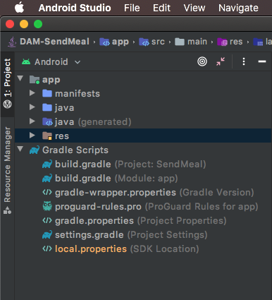
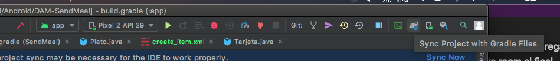

# Trabajo práctico integrador - Laboratorio 4
> Fecha de entrega para el laboratorio 4: 23 de octubre 2020


## Objetivos
- Persistir datos de nuestras aplicaciones mobile (online y offline)
- Utilizar ROOM para lograr la persistencia en el device
- Utilizar Retrofit para persistir datos online usando APIs REST
- Familiarizarnos con firebase como herramienta de backend enlatado


## Intro
Hasta ahora todas nuestras aplicaciones no manejaban datos o solo se almacenaban en memoria, perdiendose al momento de cerrar la app.

Una app suele requerir de algún mecanismo que le permita persistir datos, estos datos deber guardarse en algún lugar que este fuera del ciclo de vida de una app, ya sea dentro del mismo dispositivo (perdiendolos si el usuario decide utilizar otro o borra la app) o en algun servidor en internet a travez de servicios (como una api rest).

En este trabajo utilizaremos ambas opciones, localmente guardaremos los datos en una base de datos SQL utilizando Room y además utilizaremos Firebase, una plataforma de desarrollo de aplicaciones de Google, la cual entre sus servicios nos provee una forma sencilla persistir colleciones de JSONs a travez de una API REST.

### 1. Clonar el proyecto realizado en el laboratorio anterior

###### (De no tenerlo ya de manera local) 


 A continuación abrir el proyecto en Android Studio y hacer un checkout de la branch develop, esta rama debe contener los cambios realizados durante el [laboratorio 2](../laboratorio-02/laboratorio-02.md). 


A partir de develop, crear una nueva branch llamada lab03. Esta es la branch sobre la cual se realizará este laboratorio.  

### 2. Persistir platos creados en una base de dato SQL

En el lab anterior mencionamos que un plato debería contener:
- Título (String) 
- Descripción (String) 
- Precio (Double) 
- Calorías (Integer) 

Partiendo de esto deberíamos tener una clase similar a la siguiente, a la que le agregamos el campo `id` para poder identificar cada plato de forma única:

``` java
public class Plato {
    Long id; //Campo que agregamos
    String titulo;
    String descripcion;
    Double precio;
    Integer calorias;
}
```

### 2.1. Configurar ROOM
- 2.1.1. En el menu de la izquierda, con el android studio en la vista de `Android`, expandir la carpeta  `Gradle Scripts` y abrir el archivo `build.gradle (Module: app)`.

    
    > Es muy importante que seleccionen el que dice (Module: app) ya que existen 2 con el mismo nombre. [Si te interesa saber las diferencias podes ver por aca pero **NO es necesario para el tp.**](https://stackoverflow.com/questions/28295933/difference-between-build-gradleproject-and-build-gradlemodule)

- 2.1.2 Buscar el bloque dependencies y agregar las dependencias necesarias para room al final
    ```
    dependencies {
        // <Acá están las demás dependencias de la app, no las borres>
        // Agregamos Room components
            implementation "androidx.room:room-runtime:$rootProject.2.2.5'"
            annotationProcessor "androidx.room:room-compiler:$rootProject.2.2.5'"
            androidTestImplementation "androidx.room:room-testing:$rootProject.2.2.5'"
        }
    ```
    > Al momento de escribir esta guiá la version más reciente de room es la `2.2.5` pero uno siempre puede ir a consultar la versión más reciente del componente que necesita desde: [https://developer.android.com/topic/libraries/architecture/adding-components.html](https://developer.android.com/topic/libraries/architecture/adding-components.html)
- 2.1.3 Acabamos de agregar referencias a las librerías de room pero aún no las tenemos disponibles en nuestro proyecto, hay que avisarle a Android Studio de los cambios para que tiene que ir a descargarlas. Esto se hace mediante la opción `Sync` 

    

### 2.2. Anotando nuestras clases para ROOM

Room es una librería que permite el mapeo de objetos a SQLite a través de [Java Annotations](https://www.geeksforgeeks.org/annotations-in-java/)

> Es parte de lo que android denomina `Architecture Components` que son una colección de librerias disponibilizadas por google para facilitarnos el desarrollo de aplicaciones. 

A nuestra clase `Plato` que deseamos persistir es necesario agregarle al menos estas annotations
```java
@Entity
public class Plato {
    @PrimaryKey(autoGenerate = true)
    Long id;
    String titulo;
    String descripcion;
    Double precio;
    Integer calorias;
}
```

- `@Entity` le avisa a room que queremos que genere una tabla para esta clase, instancias de esta clase se podrán guardar como filas de la tabla.
- `@PrimaryKey` como toda tabla necesita una clave primaria es necesario agregar esta annotation en el campo que queremos que se considere como tal, en nuestro caso el id. El parámetro opcional `(autoGenerate = true)` le dice a room que queremos que administre por nosotros la generación de claves únicas.

    > Existen muchas más annotations que room nos permite utilizar y que escapan al alcance de este trabajo pero una lista completa de las mismas puede verse en [https://developer.android.com/reference/androidx/room/package-summary.html](https://developer.android.com/reference/androidx/room/package-summary.html)

### 2.3. Generando nuestros DAOs para persistir los platos

Para acceder a los datos de nuestra app utilizando la librería de persistencia room esta nos propone la utilización del patron de objeto de acceso a datos (data access object o DAO), en el que estos objetos nos proveen los métodos para acceder a los objetos de la base de datos.

El DAO para la entidad Plato, quedaría de la siguiente forma:
```java
@Dao
public interface PlatoDao {
    @Insert
    void insertar(Plato plato);

    @Delete
    void borrar(Plato plato);

    @Update
    void actualizar(Plato plato);

    @Query("SELECT * FROM plato WHERE id = :id LIMIT 1")
    Plato buscar(String id);
}
```
// TODO Completar 

## 3. Persistir los pedidos creados en la base de dato SQL.

Repetir los pasos anteriores (2.2 - 2.3) pero ahora configurando la entidad Pedido, para que sea guardada en nuestra base de datos, incluyendo sus relaciones.

## 4. Persistir los platos a través de una API Rest.

Utilizando la misma clase plato que teníamos creada y ampliamos en el paso 2, vamos a guardar los datos de dichos platos usando Retrofit.

### 4.1 Configurar Retrofit
- 4.1.1. En el menu de la izquierda, con el android studio en la vista de `Android`, expandir la carpeta  `Gradle Scripts` y abrir el archivo `build.gradle (Module: app)`.

- 4.1.2 Buscar el bloque dependencies y agregar las dependencias necesarias para Retrofit al final
    ```
    dependencies {
        // <Acá están las demás dependencias de la app, no las borres>
        // Agregamos Retrofit components
            implementation 'com.squareup.retrofit2:retrofit:2.9.0'
            implementation 'com.squareup.retrofit2:converter-gson:2.9.0'
        }
    ```
    > Al momento de escribir esta guiá la version más reciente de retrofit es la `2.9.0`. Siempre pueden consultar la ultima version en el [Github de Retrofit](https://github.com/square/retrofit/tags)
- 4.1.3 Acabamos de agregar referencias a las librerías de Retrofit, por lo que debemos hacer nuevamente un `Sync` 

    
- 4.1.4 Agrear los permisos de red al `AndroidManifest.xml`
     ```xml
    <uses-permission android:name="android.permission.INTERNET" />              
    <uses-permission android:name="android.permission.ACCESS_NETWORK_STATE" />  
    ```
- 4.1.5 Desde el API 28 en adelante, hay que permitir el trafico "cleartext HTTP". Esto es solamente porque usaremos un API-Rest local 
    ```xml
      <application
        ....
        android:usesCleartextTraffic="true"
   ```
   
### 4.2 Generar la interfaz que va a describir a nuestra API

Retrofit, tambien usa Java Anotation para describir el funcionamiento de la interfaz que vamos a generar.
 
Al momento de clarar la interfaz de nuestra API cada método debe tener una anotación HTTP que proporcione el método de solicitud y la URL relativa. 

Hay ocho anotaciones disponibles: `HTTP`, `GET`, `POST`, `PUT`, `PATCH`, `DELETE`, `OPTIONS` y `HEAD`. La URL relativa del recurso se especifica en la anotación.
``` 
@GET("platos/lista") 
```
También puede especificar parámetros de consulta en la URL.
```
@GET("platos/lista?Sort=desc")
```

Con estas notaciones vamos a ser capases de generar una Interfaz como la siguiente:

```java
public interface PlatoService {
  @GET("plato/{id}")
  Call<Plato> getPlato(@Path("id") String id);
    
  @GET("plato/list")
  Call<List<Plato>> getPlatoList();

  @POST("plato")
  Call<Plato> createPlato(@Body Plato plato);
}
```

Una vez tenemos totalmente declarados todos los metodos de nuestra API Rest, podemos inicializar una instancia de nuestra API como si fuera una Clase Java haciendo uso de `Retrofit`
```java
Gson gson = new GsonBuilder().setLenient().create();
Retrofit retrofit = new Retrofit.Builder()
    .baseUrl("{urlApiRest}/")
    // En la siguiente linea, le especificamos a Retrofit que tiene que usar Gson para deserializar nuestros objetos
    .addConverterFactory(GsonConverterFactory.create(gson)) 
    .build();

PlatoService platoService = retrofit.create(PlatoService.class);
```

Cuando tenemos creado nuestra clase, podemos llamar cualquier endpoint de nuestra API Rest, como si fuera un metodo.

```java
Call<List<Plato>> callPlatos = platoService.getPlatoList();

callPlatos.enqueue(
        new Callback<List<Plato>>() {
            @Override
            public void onResponse(Call<List<Plato>> call, Response<List<Plato>> response) {
                if (response.code() == 200) {
                    Log.d("DEBUG", "Returno Exitoso");
                }
            }

            @Override
            public void onFailure(Call<List<Plato>> call, Throwable t) {
                Log.d("DEBUG", "Returno Fallido");
            }
        }
);
```

## 5. Persistir los pedidos creados a través de una API Rest.

Repetir los pasos anteriores (4.2 - 4.3) pero ahora configurando la entidad PedidoService, para poder hacer uso de la API Rest, para guardar pedidos.

##### Recomendación:
En caso de estar usando el JSON-Server de [SendMeal-FakeAPI](https://github.com/FedeMadoery/SendMeal-FakeAPI), recuerden que la relación `1 a n` de `Pedido -> Platos`, deben guardarla con un arreglo de IDs
Ej: 
```
Pedido = {
    id: "uuidPedido",
    platosId: ["uuidPlato1", "uuidPlato2", "uuidPlato3"],
    ....
}
```
Al momento de consultar un pedido por ID, o una lista de pedidos; El API automáticamente mapeara los platos relacionados con el pedidos.
Ej:
```
Pedido = {
    id: "uuidPedido",
    platosId: ["uuidPlato1", "uuidPlato2", "uuidPlato3"],
    platos: [ {objPlato1}, {objPlato2}, {objPlato3} ]
    ....
}
```

Tambien deben recordar, que Android no permite conexiones a 'localhost', por lo que deben buscar la ip de su equipo y usar esa dirección. 
Ej: `http://192.168.16.1:3001/`