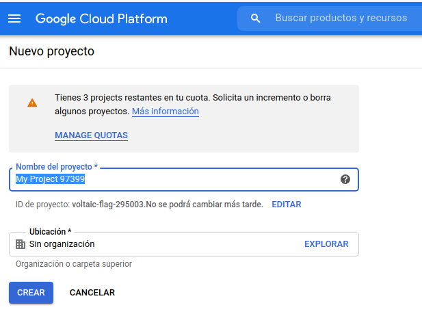
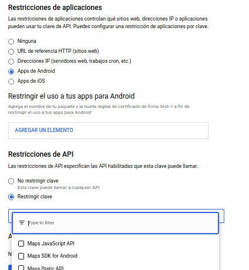
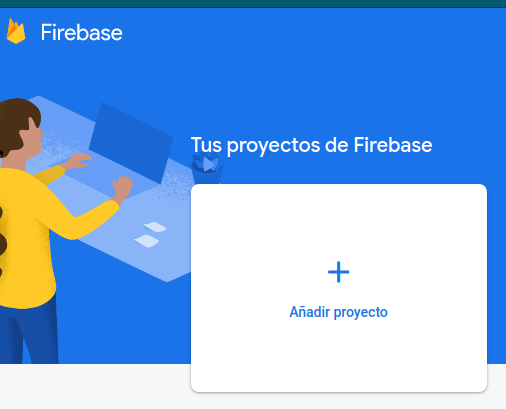
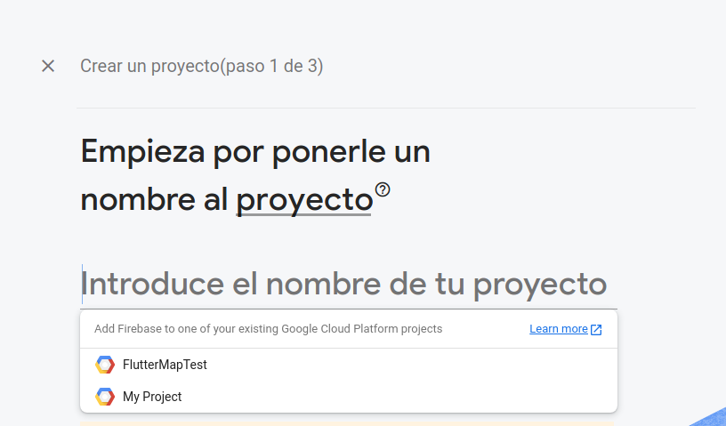
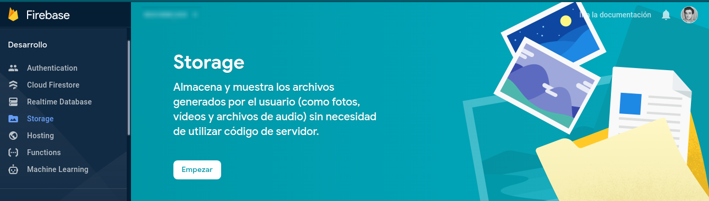
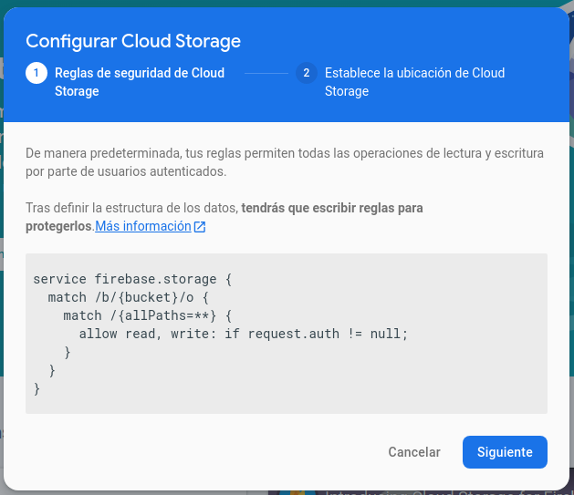
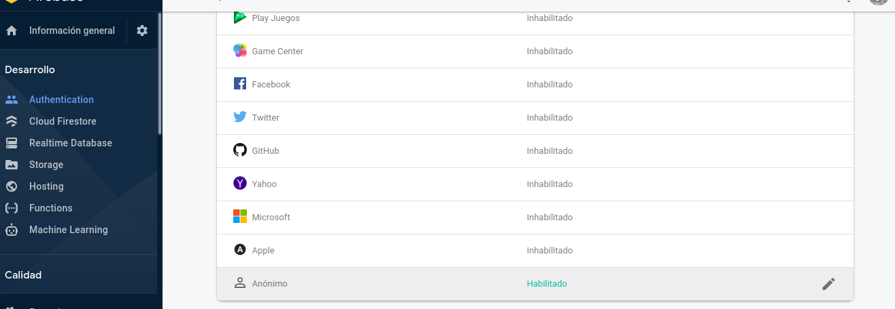

# Trabajo práctico integrador - Laboratorio 5
> Fecha de entrega para el laboratorio 5: XX - XX - XXXX


## Objetivos
- Utilizar el servicio de Google Mapas
    - Utilizar Markers
    - Dibujar formas
- Interactuar con la cámara del dispositivo para obtener una imagen 
- Utilizar Firebase para lograr la persistencia de imágenes
- Utilizar Notificaciones Push

# Intro
En este momento


### 1. Clonar el proyecto realizado en el laboratorio anterior

###### (De no tenerlo ya de manera local) 


A continuación abrir el proyecto en Android Studio y hacer un checkout de la branch develop, esta rama debe contener los cambios realizados durante el [laboratorio 4](../laboratorio-04/laboratorio-04.md). 


A partir de develop, crear una nueva branch llamada lab05. Esta es la branch sobre la cual se realizará este laboratorio.  

### 2. Obtener una clave de google developers y agregarla a la App

 * 2.1 - Con un usuario de google (uno por grupo), ingresar a [Consola de Google](https://console.developers.google.com)
 * 2.2 - Ingresar a [Administra recursos](https://console.developers.google.com/iam-admin/projects)
 * 2.3 - Crear un nuevo proyecto
 
 * 2.4 - En el menu lateral, ingresar a 'Credenciales' -> '+ Crear Credenciales' -> 'Clave de API' -> 'Restringir'
 * 2.5 - Restricciones de aplicaciones
    * Apps de Android
 * 2.6 - Restricciones de API
    * Maps SDK for Android
  
 * 2.7 - Copiar y guardar el API Key
 
Una vez que tenemos nuestra API key, debemos agregarla al `manifest.xml` para que pueda ser usada.
Vamos a `values.xml` y creamos una entrada para la clave.
```xml
<string name="google_maps_key">AIzaS……</string> 
```
Luego en el `manifest.xml`
```xml
<application 
    <!--....-->
    android:theme="@style/AppTheme" > 
    <meta-data 
        android:name="com.google.android.geo.API_KEY" 
        android:value="@string/google_maps_key" /> 
```

### 3. Crear actividad para usar el mapa
Crear una nueva activity que implemente `OnMapReadyCallback`

```java
public class MapActivity extends AppCompatActivity implements OnMapReadyCallback{ 
    private GoogleMap myMap; 
 
    @Override 
    protected void onCreate(Bundle savedInstanceState) { 
        super.onCreate(savedInstanceState); 
        setContentView(R.layout.activity_map); 
        SupportMapFragment mapFragment = (SupportMapFragment) getSupportFragmentManager() 
                .findFragmentById(R.id.map); 
        mapFragment.getMapAsync(this); 
    } 
 
 
    @Override 
    public void onMapReady(GoogleMap googleMap) { 
        myMap=googleMap; 
        // COMPLETAR     
    } 
}
```
Ahora solo resta modificar el Layout agregando un fragmento para el mapa
```xml
<fragment 
    android:id="@+id/map" 
    android:name="com.google.android.gms.maps.SupportMapFragment" 
    android:layout_width="match_parent" 
    android:layout_height="match_parent"  /> 
```

### 4. Indicar la ubicación de envío

Al momento de realizar un pedido, se debe agregar la opción de seleccionar la ubicación a la cual se va a enviar el pedido.
Para esto debemos agregar un método que nos permita obtener la ubicación al momento de realizar el pedido, en dicho método
implementar el llamado a la actividad definida anteriormente mediante `startActivityForResult` pasando como parámetro la
ubicación LatLng donde el usuario hizo click en el mapa. Para tomar la ubicación usar `OnMapLongClickListener`.

Al momento de abrir el mapa se debe ir a donde esta posicionado, por lo que debe solicitar el permiso `ACCESS_FINE_LOCATION`
(recuerde que a partir de Android 6 debe solicitarlo en tiempo de ejecución. Luego cuando el mapa carga indicar 
`setMyLocationEnabled(true)` y aparecerá la posibilidad de ir a las coordenadas actuales. 

_Recordar modificar la entidad Pedido para contener el atributo Ubicación._

### 5. Indicar la ubicación del local

Modificar la activity creada anteriormente, para generar un punto aleatorio que indica donde está el restaurante que te
envía el pedido (Usar un Marker distintivo para indicar la posición).

Para generar el punto aleatorio usar [SphericalUtil](https://googlemaps.github.io/android-maps-utils/javadoc/com/google/maps/android/SphericalUtil.html), 
que es una clase de [Android Map Utils](https://github.com/googlemaps/android-maps-utils), la cual vamos a agregar de igual
forma que veníamos haciendo con las anteriores en el gradle.

```
dependencies {
    // Utilities for Maps SDK for Android (requires Google Play Services) 
    implementation 'com.google.maps.android:android-maps-utils:2.1.0'

    // Alternately - Utilities for Maps SDK v3 BETA for Android (does not require Google Play Services)
    implementation 'com.google.maps.android:android-maps-utils-v3:2.1.0'
}
```

// TODO Agregar ejemplo de uso

Usar la Latlng generada para crear un marcador en el mapa.

### 6. Dibujar el recorrido del pedido

Para este propósito, vamos a suponer que la ruta de envió va a ser en linea recta entre ambos puntos, no es un caso de uso
real pero para los efectos prácticos es valido.

A esta altura tenemos generados ambos puntos, el del local y donde se va a recibir el pedido, con esta información vamos
a crear una línea recta que los una. Para esto vamos a usar Polyline
```
var polylineOptions = new PolylineOptions();
polylineOptions.InvokeColor(0x66FF0000);

// Agregar ambos puntos 
polylineOptions.Add(new LatLng(position.Latitude, position.Longitude));

myMap.AddPolyline(polylineOptions);
```

### 7. Agregar y configurar Firebase

Ahora vamos a crear nuestro proyecto en firebase y añadir nuestra App al mismo, para esto

 * 7.1- Ingresar a la [Consola de Firebase](https://console.firebase.google.com/?hl=es) con la misma cuenta de google 
 que usamos en el punto dos.
 * 7.2- Añadimos un nuevo proyecto.
    
    ###### Pueden elegir automáticamente el mismo nombre que el proyecto que creamos en el punto dos
    
 * 7.3- Ahora vamos a añadir firebase a nuestra App
    ###### Luego de crear el proyecto, en la pagina principal veran la opción de añadir una aplicación android
    
 * 7.4- Completar el registro paso a paso.
 
> [Paso a paso en mayor detalle](https://firebase.google.com/docs/android/setup?authuser=0)

Ahora que ya tenemos firebase en nuestra aplicación, ya podemos comenzar a hacer uso de todas sos prestaciones. Entre las
cuales podemos destacar: 
- [Authentication](https://firebase.google.com/docs/auth?authuser=0)
- [Cloud Storage](https://firebase.google.com/docs/storage?authuser=0)
- [Realtime Database](https://firebase.google.com/docs/database?authuser=0)
- [Cloud Messaging](https://firebase.google.com/docs/cloud-messaging?authuser=0)
- [App Distribution](https://firebase.google.com/docs/app-distribution)

De las cuales nosotros vamos a usar solamente Cloud Storage, para guardar una foto al momento de dar de alta un plato.

### 8. Configurar Cloud Storage
Lo primero que vamos a hacer es agregar las dependencias que necesitamos:
```
dependencies {
    // Import the BoM for the Firebase platform
    implementation platform('com.google.firebase:firebase-bom:25.12.0')

    // Declare the dependency for the Cloud Storage library
    // When using the BoM, you don't specify versions in Firebase library dependencies
    implementation 'com.google.firebase:firebase-storage'
    // Declare the dependency for the Firebase Authentication library
    implementation 'com.google.firebase:firebase-auth'
}
```
Luego, en el menu lateral izquierdo de firebase, vamos a ir a Desarrollo/Storage y vamos a habilitarlo.


Hacemos click en 'Empezar' y nos va a salir un modal como el siguiente


El cual nos indica que por default las reglas de seguridad de Cloud Storage, permiten lectura y escritura solo a usuario 
autenticados, por lo que nuestro próximo paso será habilitar la autenticación anónima. Para completar la configuración de 
Cloud Storage, deben hacer click en siguiente y por ultimo en listo.

> Autenticación anónima:  Crea cuentas anónimas temporales para permitir el uso de funciones que requieran autenticación 
> sin exigir que los usuarios accedan primero. Firebase se encarga de gestionar este tipo de cuentas, las cuales solamente
> se pueden crear desde nuestra aplicación la cual fue previamente registrada en un proyecto, y dichas cuentas tienen acceso 
>restringido a ese proyecto en particular.

<details>
  <summary>Aclaración: </summary>
  No es objetivo del trabajo practico hacer uso de Firebase Authentication, solamente vamos a configurar la autenticación anónima para tener un minimo de seguridad sobre nuestras operaciones de lectura/escritura, lo cual es recomendado.
</details>

Para habilitar la Autenticación anónima, debemos ir a Desarrollo/Authentication y habilitar "Anónimo"


Una vez echo esto, debemos agregar el siguiente código a nuestra actividad principal

```java
public class MainActivity {
    private FirebaseAuth mAuth;
    // ...
    
   @Override
   protected void onCreate(Bundle savedInstanceState) {
    // ...
    // Inicializar Firebase Auth
    mAuth = FirebaseAuth.getInstance();
    // Iniciar Session como usuario anónimo
    signInAnonymously();
   }

    private void signInAnonymously() {
    mAuth.signInAnonymously()
        .addOnCompleteListener(this, new OnCompleteListener<AuthResult>() {
            @Override
            public void onComplete(@NonNull Task<AuthResult> task) {
                if (task.isSuccessful()) {
                    // Exito
                    Log.d(TAG, "signInAnonymously:success");
                    FirebaseUser user = mAuth.getCurrentUser();
                } else {
                    // Error
                    Log.w(TAG, "signInAnonymously:failure", task.getException());
                    Toast.makeText(AnonymousAuthActivity.this, "Authentication failed.",
                            Toast.LENGTH_SHORT).show();
                }
            }
        });
    }
}
```

Ahora cada vez que nuestra aplicación inicie, se va a autenticar automáticamente como un usuario anónimo. Ahora si, ya estamos 
listos para usar Cloud Storage.

### 9. Guardar archivos en Cloud Storage.

Como mencionamos anteriormente, la idea de usar Cloud Storage es que nos permita almacenar las imágenes de los platos que se crean.
Para esto deberán agregar, en la actividad encargada de dar de alta los platos, un intent a la cámara y al recibir el resultado,
lo almacenaran en Cloud Storage; Esta operación nos retornara un "path", que es la dirección en la cual se guardo la imagen, 
dicho path lo vamos a almacenar en el objeto Plato que ya teníamos de los laboratorios anteriores.

Para lograr esto, debemos hacer un Intent para obtener una imagen, ya sea desde la cámara o desde los archivos
```java
// TODO Intent a camara
```
Una vez que tenemos nuestra imagen, vamos a subirla al Storage

```java
public class SomeActivity {
    // ... 
    private void someFunction() {
       // Creamos una referencia a nuestro Storage
       StorageReference storageRef = storage.getReference();
    
       // Creamos una referencia a 'images/plato_id.jpg'
       StorageReference platosImagesRef = storageRef.child("images/plato_id.jpg");
   }
}
```

Una vez que crees una referencia apropiada, podemos llamar al método `putBytes()`, `putFile()` o `putStream()` para subir el archivo 
a Cloud Storage.

```java
public class SomeActivity {
    // ... 
    // Función donde vamos a guardar la imagen
    private void someFunction() {

        // Cual quiera de los tres metodos tienen la misma implementación, se debe utilizar el que corresponda
        UploadTask uploadTask = platosImagesRef.putBytes(data);
        // UploadTask uploadTask = platosImagesRef.putFile(file);
        // UploadTask uploadTask = platosImagesRef.putStream(stream);
       
        // Registramos un listener para saber el resultado de la operación
        Task<Uri> urlTask = uploadTask.continueWithTask(new Continuation<UploadTask.TaskSnapshot, Task<Uri>>() {
            @Override
            public Task<Uri> then(@NonNull Task<UploadTask.TaskSnapshot> task) throws Exception {
                if (!task.isSuccessful()) {
                    throw task.getException();
                }
        
                // Continuamos con la tarea para obtener la URL
                return platosImagesRef.getDownloadUrl();
            }
        }).addOnCompleteListener(new OnCompleteListener<Uri>() {
            @Override
            public void onComplete(@NonNull Task<Uri> task) {
                if (task.isSuccessful()) {
                    // URL de descarga del archivo
                    Uri downloadUri = task.getResult();
                } else {
                    // Fallo
                }
            }
        });
    }
}
```

Una vez que obtenemos la Uri, la debemos guardar como una propiedad de nuestro objeto plata para luego poder descargarla 
y mostrarla.

### 10. Descargar archivos de Cloud Storage

```java
public class SomeActivity {
    // ... 
    // Función donde vamos a descargar la imagen
    private void someFunction() {
        // Creamos una referencia al storage con la Uri de la img
        StorageReference gsReference = storage.getReferenceFromUrl("gs://bucket/images/something.jpg");
        
        // TODO codigo para descargar
    }
}
```