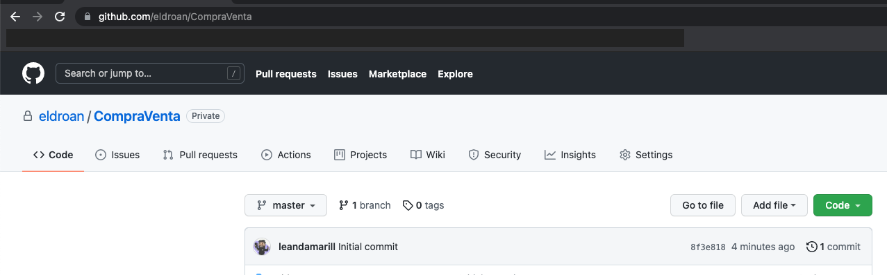

# Trabajo práctico integrador - Laboratorio 1
> Fecha de entrega para el laboratoratorio 1: XX de XX 2020
## Objetivos

- Familiarizarse con Android Studio
- Aprender a configurar control de versiones con GIT
- Utilizar los distintos componentes gráfico disponibles para implementar un formulario

## Tareas a desarrollar

### 1. Crear el proyecto

1. Abrir android studio y seleccionar la opcion para comenzar un nuevo proyecto.
   
2. Seleccionar `Empty Activity` como template
   
3. En la sección de configuración de proyecto seleccione.

   - Seleccione `JAVA` como lenguaje
   - Seleccione un nombre para la aplicacion
   - Nombre del paquete (Puede utilizar un nombre que identifique a su grupo)
   - Seleccionar el Minimun SDK (Se recomienda API 23, como mínimo elija el API correspondiente a su dispositivo para poder ejecutar la aplicación)
   - Seleccione la opción para utilizar las librerías legacy

   > Asegúrese de haber seleccionado Java como lenguaje ya que Android Studio en sus versiones más recientes pre-selecciona Kotlin.

   

### 2. Configurar GIT

1. Es necesario tener una cuenta de Github, en caso de no tenerla puede registra una en [https://github.com](https://github.com)
2. Desde Android Studio, en la barra superior de tareas seleccione la opcion VCS → Import into Version Control → Share Project on Github
   
3. Asignamos el nombre de nuestro repositorio en Github bajo `Repository Name` asegurandonos que la opcion `Private` se encuentre des-marcada y presionamos `Share`.

   

   > Es necesario que el repositorio sea publico para poder realizar la correción de los trabajos prácticos. Para usos personales puede utilizar repositorios privados, los cuales solo pueden ser visualizados con la autorización del creador.

   > El campo `Remote` es el nombre con el cual git identificará localmente a este nuevo repositorio remoto en Github, es recomendado dejar el nombre `origin` ya que es la convención para los casos con un único repositorio remoto como el nuestro.

4. Para finalizar con la creación de nuestro repositorio debemos inicializarlo con un primer commit, la siguiente ventana de Android Studio nos presenta la opcion de agregar todos los archivos al seguimiento de GIT. Colocamos un mensaje para nuestro primer commit y luego presionamos `Add`

   

   > Recordemos que git solo realiza seguimiento de los archivos que le nosotros le indicamos o `tracked`, los que no, apareceran como `untracked`.

   > Apretar el boton `Add` en Android Studio para inicializar el repositorio realizo 2 acciones, primero realizo un `commit` a nuestro repositorio local y luego realizo un `push` al repositorio remoto en Github.

5. Verificar información en Github. La url del repositorio suele seguir la forma
   ```
   https://github.com/{USUARIO}/{NOMBRE_REPOSITORIO}
   ```
   

6. Crear la rama/branch `develop`, haciendo click con el IDE (Android Studio) en la barra inferior del margen derecho.


7. Crear una nueva rama con el nombre `lab01`.

    
    > Asegurarse de que se encuentre trabajando en la rama lab01 para la realizacion del laboratorio 1.

### 3. Configurar UI - (LinearLayout)
1. Para asegurarse que todo se encuentre funcionando correctamente probemos correr la aplicación generada presionando el boton verde con una flecha. Una vez que cargue deberíamos ver el mensaje 'Hello World' en pantalla

2. El mensaje 'Hello World!' que podemos observar se encuentra en la carpeta 'res' → 'layout' → 'activity_main.xml'. Para la realizacion del laboratorio utilizaremos un `LinearLayout` de orientación vertical pero el archivo 'activity_main.xml' fue autogenerado utilizando un `ConstrainLayout` por lo que tendremos que cambiarlo
    1. Abra 'activity_main.xml' y asegurese de tener seleccionada la opción `design`.
    
    2. Seleccione la `ContraintLayout` en el arbol de componentes y presione 'Convert view...' y seleccione `LinearLayout`
    
    
    3. Por default el `LinearLayout` coloca los elementos de forma horizontal. Para cambiar este comportamiento realizamos click → LinearLayout → Convert orientation to vertical
    

### 4. UI Propuesta

Se plantea realizar la pantalla de carga de clasificados en la app, esta pantalla cuenta con gran cantidad de inputs y deberá reaccionar al estado de los inputs (ej: no dejar dar de alta el clasificado si faltan campos por completar)


> Este diseño es ilustrativo, no es necesario recrearlo mientras los componentes requeridos esten presentes.

#### Consideraciones

* Para el armado de la interface, no deberá usar texto directo, sino que deberá escribir todos los String en el archivo strings.xml 
* Los colores personalizadores deberan ser creados en el archivo colors.xml
* Crear en el directorio res/values el archivos dimensiones.xml ( click en el menú “File” → New → Values Resource File ) para almacenar los tamaños de elementos y fuentes


#### Elementos
* El título del clasificado como input de tipo `plain text`
* El correo electronico de contacto como campo de tipo `e-mail`
* La descripción del clasificado como input de tipo `plain text` de multiples lineas
* El precio del clasificado como un input `numerico` 
* La categoría del clasificado como un `spinner` con las opciones ( INDUMENTARIA, ELECTRONICA, ENTRETENIMIENTO, JARDIN, VEHICULOS, JUGUETES )
* Un slider (`seekbar`) para que el vendedor indique el porcentaje del costo de envio desea cubrir (valores entre 0 y 100).
    * [https://developer.android.com/reference/android/widget/SeekBar](https://developer.android.com/reference/android/widget/SeekBar)
    * [https://www.geeksforgeeks.org/android-creating-a-seekbar/](https://www.geeksforgeeks.org/android-creating-a-seekbar/)
* Usar un switch button con la leyenda 'Ofrecer descuento de envío' que controle la visibilidad del slider que define el porcentaje de descuento.
    * Para esto escuchar el evento de cambio en el botón. Si el botón está activado entonces mostrar los elementos de la cuenta usando el atributo visibility que puede tomar dos valores, `gone` (sale el elemento de la vista), y `visible` el elmento se muestra en la vista.
    
        En XML:
        ```xml
        android:visibility="gone"
        ```
         En listener de eventos usar:
        ```java
        slider.setVisibility(View.GONE) 
        ```
* Utilizar un checkbox para indicar que acepta `Retiro en persona`
    * Si se aceptan retiros en persona deberá aparecer un input de texto para completar la direccion de retiro (Como no es la idea hacer algo real asumiremos que esto es suficiente).
* Utilizar un checkbox para aceptar términos y condiciones.
    * Aquí también deberá capturar el evento de chequeado o no chequeado
* Finalmente un boton de 'Publicar', este se habilita si y solo si, se aceptan los términos y condiciones.

#### Validaciones
1. Los siguientes datos son obligatorios:
    * Titulo
    * Precio
    * Categoría
    * Si se acepta `Retiro en persona` debe completarse la direccion de retiro
2. Si se activo 'Ofrecer descuento de envío' el porcentaje del slider debe ser mayor a 0%. Si el monto cubirto es 0% mostrar el mensaje 'Por favor seleccione un porcentaje mayor a 0 o quite la opcion de ofrecer descuento de envio.'
3. El precio del producto debe ser mayor a 0.
4. Si se ingreso un correo verificar que el correo electrónico tenga al menos una @ y 3 letras luego de la arroba
5. Asegurarse que los campos que admiten texto plano solo contengan letras (mayusculas o minusculas), números, comas, puntos o saltos de linea (ej: un texto que incluya `<` debe considerarse inválido). Tip: Puede utilizar la clase [Pattern](https://docs.oracle.com/javase/7/docs/api/java/util/regex/Pattern.html) de java y expresiones regulares.
6. Cualquier condición de las anteriores que no se cumpla deberá mostrar un mensaje con el toast notificando al usuario. Si todas las validaciones son cumplidas notificar al usuario utilizando un toast con un mensaje de exito.

### 5. Persistir en git y compartir en github
1. Verificar que la app se encuentre funcionando al presionar el botton `Play`
2. Desde android studio presionar `VCS` → `Commit` o el atajo de teclado `CTRL + K` (Win y Linux) o `CMD + K` (Mac)
    
3. En la ventana seleccione todos los archivos que desea persistir en el commit y asegurarse de:
    * Escribir un mensaje de commit significativo de los cambios que realizo
    * Completar el nombre del autor en formato `userDeGit <correo@electronico.com>`
    * Destildar `Perform code analysis` y `Check TODO` (No es estrictamente necesario, si no los destildamos nos mostrara un warning con cosas que el ide considera que podrian mejorarse o mensajes marcados como "TO-DO")

    

    EJEMPLO:
    
    > Notese que en este ejemplo solo se estan subiendo las clases del model, esto es porque en este caso ya se habian realizado commits previos con otras partes del lab. Ademas, no se esta subiendo el contenido de la carpeta `.idea` ya que son archivos de configuración del IDE y no es necesario. 
4. Una vez completados los datos del commit presionar el botón `Commit` para efectuar la acción
5. Con nuestros cambios commiteados en nuestro repositorio local es momento de persistirlos en github, para esto necesitamos realizar un `PUSH` a nuestro repositorio remoto (en github), desde el IDE podemos encontrarla presinando  `VCS` → `Git` → `Push` o el atajo de teclado `CTRL + SHIFT + K` (Win y Linux) o `CMD + SHIFT + K` (Mac)

    
6. Luego nos aparecera una ventana de confirmacion con los commits que esten en nuestro repositorio local y no en el remoto, estos son los commits que seran pusheados.
    
    
    > En la imagen se puede ver que nos indica que la rama lab-01 (local) sera pusheado ( → ) a la rama lab-01 en github (origin, o el nombre que le hayamos asignado al `Remote` en el paso 3 del item 2 - Configurar GIT)
7. Si todo esta ok presionamos `Push` y comenzará a realizar el proceso para pushear nuestros cambios a github (Es posible que nos pida nuestras credenciales de acceso a github si no las habiamos puesto antes).
8. Comprobar en el sitio
    * Navegar a `https://github.com/{usuario}/{nombre-de-repo}/`
    * Seleccionar la rama lab-1
    * Comprobar que se vea reflejado el commit que hemos realizado
    
    

