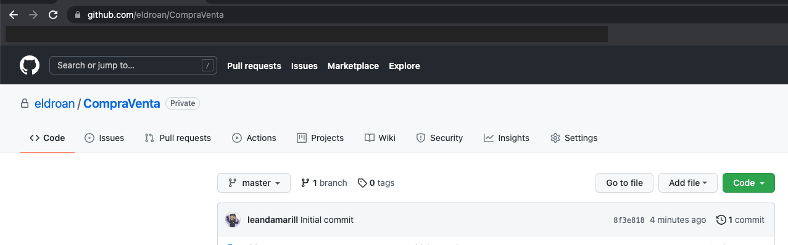

# Trabajo práctico integrador - Laboratorio 2
> Fecha de entrega para el laboratoratorio 2: 24 de Septiembre 2021
## Objetivos

- Utilizar Intent explícitos y gestionar actividades
- Usar widgets de listas (RecyclerView)
- Usar adaptadores personalizados
- Utilizar Git en diversas ramas

## Tareas a desarrollar


### 1. Clonar el proyecto realizado en el laboratorio anterior
###### (De no tenerlo ya de manera local)



De esta manera ahora tiene una copia del proyecto en su repositorio local. A continuación abrir el proyecto en Android Studio y hacer un checkout de la branch develop.

A partir de develop, crear una nueva branch llamada lab02. Esta es la branch sobre la cual se realizrá el taller 2.

Consultar el tutorial presentado en el taller 1 ante cualquier duda. 

### 2. Crear una actividad para listar las categorias.

Crear una actividad que permita visualizar la lista de categorias que se le pueden asignar a un producto.

Para esto, deberá utilizar de manera obligatoria un _RecyclerView_ utilizando el patrón _ViewHolder_.

Deberá mostrar la lista de categorias, donde para cada entrada se muestre:
- El nombre de la categoria.
- Un fondo del color relacionado a esa categoria

Para ello, realizar las siguientes acciones:

- Crear un nuevo layout llamado `fila_cat.xml`. El layout que se utilice para la distribución de estos datos, queda a elección del desarrollador.
- Se puede utilizar un  [CardView](https://developer.android.com/guide/topics/ui/layout/cardview) para lograr una apariencia más elegante.
- Se puede utilizar un _LinearLayout_ o _ConstraintLayout_ con menor complejidad.
- Crear una clase _CategoryViewHolder_ que tenga punteros a los elementos de la interface gráfica del layout creado. Esta clase debe extender de `RecyclerView.ViewHolder`
- Crear el adaptador que represente la lista de platos. Esta clase debe extender de `RecyclerView.Adapter<CategoryViewHolder> `

Para usar el _Recycler_ ( y eventualmente el _CardView_) agregar como dependencia:
 ```
implementation 'androidx.constraintlayout:constraintlayout:1.1.3' 
implementation 'androidx.recyclerview:recyclerview:1.0.0' 
implementation 'androidx.cardview:cardview:1.0.0' 
```
#### Lista de categorias
<details>
<summary>Expandir</summary>
<div class="highlight">
<pre class="highlight">
<code>
{
    "id": "MLA5725",
    "name": "Accesorios para Vehículos"
  },
  {
    "id": "MLA1512",
    "name": "Agro"
  },
  {
    "id": "MLA1403",
    "name": "Alimentos y Bebidas"
  },
  {
    "id": "MLA1071",
    "name": "Animales y Mascotas"
  },
  {
    "id": "MLA1367",
    "name": "Antigüedades y Colecciones"
  },
  {
    "id": "MLA1368",
    "name": "Arte, Librería y Mercería"
  },
  {
    "id": "MLA1743",
    "name": "Autos, Motos y Otros"
  },
  {
    "id": "MLA1384",
    "name": "Bebés"
  },
  {
    "id": "MLA1246",
    "name": "Belleza y Cuidado Personal"
  },
  {
    "id": "MLA1039",
    "name": "Cámaras y Accesorios"
  },
  {
    "id": "MLA1051",
    "name": "Celulares y Teléfonos"
  },
  {
    "id": "MLA1648",
    "name": "Computación"
  },
  {
    "id": "MLA1144",
    "name": "Consolas y Videojuegos"
  },
  {
    "id": "MLA1500",
    "name": "Construcción"
  },
  {
    "id": "MLA1276",
    "name": "Deportes y Fitness"
  },
  {
    "id": "MLA5726",
    "name": "Electrodomésticos y Aires Ac."
  },
  {
    "id": "MLA1000",
    "name": "Electrónica, Audio y Video"
  },
  {
    "id": "MLA2547",
    "name": "Entradas para Eventos"
  },
  {
    "id": "MLA407134",
    "name": "Herramientas"
  },
  {
    "id": "MLA1574",
    "name": "Hogar, Muebles y Jardín"
  },
  {
    "id": "MLA1499",
    "name": "Industrias y Oficinas"
  },
  {
    "id": "MLA1459",
    "name": "Inmuebles"
  },
  {
    "id": "MLA1182",
    "name": "Instrumentos Musicales"
  },
  {
    "id": "MLA3937",
    "name": "Joyas y Relojes"
  },
  {
    "id": "MLA1132",
    "name": "Juegos y Juguetes"
  },
  {
    "id": "MLA3025",
    "name": "Libros, Revistas y Comics"
  },
  {
    "id": "MLA1168",
    "name": "Música, Películas y Series"
  },
  {
    "id": "MLA1430",
    "name": "Ropa y Accesorios"
  },
  {
    "id": "MLA409431",
    "name": "Salud y Equipamiento Médico"
  },
  {
    "id": "MLA1540",
    "name": "Servicios"
  },
  {
    "id": "MLA9304",
    "name": "Souvenirs, Cotillón y Fiestas"
  },
  {
    "id": "MLA1953",
    "name": "Otras categorías"
  }
</code></pre></div>>

</details>

### 3. Utilizar la nueva actividad

Una vez realizada la RecyclerView, debemos utilizarla para remplazar el `spinner` que habiamos puesto anteriormente para seleccionar las categorias.

El flujo de trabajo de esta nueva actividad, seria el siguiente:

* El usuario crea un clasificado.
  * Presiana sobre `Selecionar Categoria` y es redireccionado a la nueva lista.
  * Al seleccionar una categoria, vuelve a la pantalla anterior.
  * Se muestra la cateoria seleccionada en el campo correspondiente.


### Entrega del Trabajo.

Al finalizar el trabajo práctico realizar un “Merge” de la rama “lab02” a la rama “develop” (el trabajo práctico se corregirá en la rama develop). 
