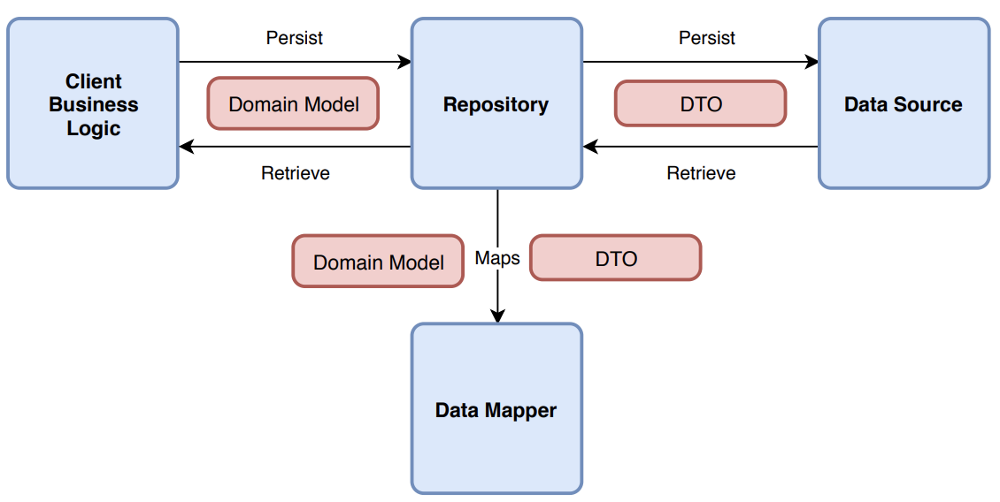
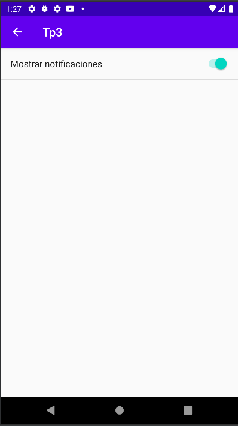

# Trabajo Practico 2 - Etapa 1
> Laboratorio 3
>
> Presentado: _Viernes 15 de Octubre 2021_
>
> Entrega: TBD

## Objetivos
- Utilizar widgets de Material Design
- Familiarizarse con las preferencias de android
- Uso de notificaciones locales
- Persistencia de datos en de manera local


## Introducción

Para la realización de esta etapa del trabajo práctico la idea es desarrollar una nueva aplicación para crear notas de texto que lancen una notificación local a una hora definida como una suerte de recordatorio. Cada nota incluye un bloque de texto a mostrar y una fecha en la cual deberá enviarse el recordatorio.

La aplicación contará con las siguientes 3 pantallas:
- Pantalla de listado de recordatorios creados
- Pantalla de creación de recordatorios
- Pantalla de configuraciones de la app

En la aplicación utilizaremos un drawer que se mostrará en la pantalla de listado, pudiendo utilizarlo para navegar entre ellas. La pantalla de creación de recordatorios  y configuraciones se acceden desde el listado y por lo tanto utilizará una appbar con botón de back.

## Ejercicio 1

1. Crear un nuevo proyecto de android, arrancar con una empty activity y asegurarse de marcar la opción para utilizar las support libraries legacy.

2. Agregar la dependencia de Material Components a nuestro proyecto. Tengamos en cuenta que nuestra app se encuentra utilizando la vieja librería de soporte y no androidx, es por esto que no podremos utilizar las versiones más recientes.

3. En el build.gradle de nuestro módulo, en la sección dependencies, agregar la dependencia de la librería de soporte que contiene los elementos de materia
    ```groovy
    dependencies {
      // ...
      implementation 'com.android.support:design:28.0.0'
      // ...
    }
    ```
4. Asegurarnos que nuestras Activities se extienden desde AppCompatActivity para evitar comportamientos extraños.
Asegurarnos que nuestros themes extiendan de uno de los themes de material componentes. 

   Para hacer esto, en el archivo themes.xml que nos auto generó android studio podemos modificar el parent reemplazando Theme.AppCompat.x.x por alguno de los siguientes:
	- Theme.MaterialComponents
    - Theme.MaterialComponents.NoActionBar
    - Theme.MaterialComponents.Light
    - Theme.MaterialComponents.Light.NoActionBar
    - Theme.MaterialComponents.Light.DarkActionBar
    - Theme.MaterialComponents.DayNight
    - Theme.MaterialComponents.DayNight.NoActionBar
    - Theme.MaterialComponents.DayNight.DarkActionBar
5. Finalmente solo queda utilizarlos de forma similar a lo que hacíamos con los componentes tradicionales. Es importante aclarar que los viejos componentes siguen funcionando como antes, material components agrega nuevos que comienzan con com.google.android.material

### Links Útiles:

Ayuda de instalación: 

https://material.io/develop/android/docs/getting-started

Referencia de material components:

https://material.io/components?platform=android


## Ejercicio 2

Primero desarrollaremos la Activity para la creación de recordatorios. En su layout deberá presentarnos un campo de texto para completar el contenido del recordatorio y otro para seleccionar la hora en la que seremos recordado. Finalmente deberá contar con un botón que usaremos para guardar nuestro recordatorio.

Para el desarrollo de la misma debe utilizar los siguientes componentes de material
- Text field o Text Area - https://material.io/components/text-fields/android#using-text-fields
- Date picker (opcional pero recomendado) - https://material.io/components/date-pickers/android#using-date-pickers
- Button - https://material.io/components/buttons/android#using-buttons

La persistencia del recordatorio la abordaremos en una actividad posterior, en este momento nos enfocaremos en la gestión de las notificaciones.

Para mostrarle al usuario una notificación con el texto del recordatorio el comportamiento esperado es el siguiente:
1. El usuario presiona el botón guardar.
2. Configurar una alarma utilizando el Alarm Manager a la fecha y hora seleccionada.
3. Nuestro BroadcastReceiver recibe la alarma y genera la notificación a mostrar.

Podemos acceder al Alarm Manager desde una activity de la siguiente forma
```java
// Recuperando el alarm manager
final AlarmManager alarm = (AlarmManager) getSystemService(Context.ALARM_SERVICE);

// Seteo de la alarma  
alarm.set(AlarmManager.RTC_WAKEUP, tiempoEnMillis, pendingIntentConActionParaMiBroadcastReceiver);
```

Referencia AlarmManager: https://developer.android.com/training/scheduling/alarms

Luego para recibir estas alarmas necesitamos crear nuestra propia clase que extienda de BroadcastReceiver

Referencia Broadcasts: https://developer.android.com/guide/components/broadcasts

```java
public class RecordatorioReceiver extends BroadcastReceiver {
    public static String RECORDATORIO = "com.example.tp3.RECORDATORIO";
    public static String TEXTO = "TEXTO";
    
    @Override
    public void onReceive(final Context context, final Intent intent) {
		// Solo nos interesa la accion que hemos definido nosotros
        if(intent.getAction().equals(RECORDATORIO)){
			// Toast de ejemplo, acá debería armarse la notificación
            Toast.makeText(context, "LLEGUE! " + intent.getStringExtra(TEXTO), Toast.LENGTH_LONG).show();
        }
    }
}
```

Además, no debemos olvidar de registrar nuestro receiver en el manifest para que android sepa de su existencia.

Finalmente para generar una notificación desde nuestro broadcast receiver podemos apoyarnos en la documentación de google de notificaciones

Referencia Notifications: https://developer.android.com/training/notify-user/build-notification?hl=es-419

> Recordar: En las versiones de android desde la 8.0 en adelante es necesario crear un notification channel antes de poder enviar una notificación.

## Ejercicio 3

En este punto comenzaremos a trabajar con la persistencia de la app.

Las operaciones necesarias sobre los recordatorios son:
- Crear un nuevo recordatorio
- Recuperar todos los recordatorios creados

Para estructurar la persistencia de nuestra app nos apoyaremos en el patrón Repositorio. En él definimos un objeto repositorio el cual expone una interfaz única para persistir y recuperar nuestros modelos del dominio (en este caso un objeto Recordatorio). El repositorio dentro de sí interactúa a través de una interfaz DataSource que define las operaciones sobre el objeto y son sus implementacion de clases concretas las encargadas de realizar la persistencia ya sea mediante una API Rest, de manera local usando Room o utilizando SharedPreferences. 


> Un detalle es que si bien modelo y el dto buscan hacer referencia a la misma "entidad" sus representaciones suelen ser distintas. Por ejemplo, una implementación de un data source para una base de datos relacional probablemente contenga campos ID en sus DTO que podrían no ser relevantes para el modelo. Es por esto que en el gráfico aparece una entidad Data Mapper encargada de la conversión.

Como modelo para el objeto Recordatorio se propone el siguiente:

```java
public class RecordatorioModel {  
    private String texto;  
 private Date fecha;  
  
 public RecordatorioModel(final String texto, final Date fecha) {  
        this.texto = texto;  
 this.fecha = fecha;  
 }  
  
    public String getTexto() {  
        return texto;  
 }  
    public void setTexto(final String texto) {  
        this.texto = texto;  
 }  
    public Date getFecha() {  
        return fecha;  
 }  
    public void setFecha(final Date fecha) {  
        this.fecha = fecha;  
 }  
  
    @Override  
 public boolean equals(final Object other) {  
        if (this == other) {  
            return true;  
 }  
        if (other == null || !getClass().equals(other.getClass())) {  
            return false;  
 }  
        final RecordatorioModel that = (RecordatorioModel) other;  
 return Objects.equals(this.texto, that.texto) && Objects.equals(this.fecha, that.fecha);  
 }  
  
    @Override  
 public int hashCode() {  
        return Objects.hash(texto) + Objects.hash(fecha);  
 }  
}
```

En base a este modelo una interfaz que cumple nuestros requisitos es la siguiente.

```java
public interface RecordatorioDataSource {
    interface GuardarRecordatorioCallback {
        void resultado(final boolean exito);
    }

    interface RecuperarRecordatorioCallback {
        void resultado(final boolean exito, final List<RecordatorioModel> recordatorios);
    }

    void guardarRecordatorio(final RecordatorioModel recordatorio, final GuardarRecordatorioCallback callback);
    void recuperarRecordatorios(final RecuperarRecordatorioCallback callback);
}
```

Luego nuestro objeto repository puede recibir una implementación de la interfaz por parámetro sin conocer realmente de dónde vienen estos datos.

```java
public class RecordatorioRepository {
    private final RecordatorioDataSource datasource;
    public RecordatorioRepository(final RecordatorioDataSource datasource) {
        this.datasource = datasource;
    }
	
	// Metodos que recuperan los recordatorios usando el data source
	
}	
```

Para la persistencia en este punto utilizaremos las SharedPreferences de android así que será necesario implementar una clase como la siguiente

```java
public class RecordatorioPreferencesDataSource implements RecordatorioDataSource {
	private final SharedPreferences sharedPreferences;
    RecordatorioPreferencesDataSource(final Context context) {
        sharedPreferences = PreferenceManager.getDefaultSharedPreferences(context);
    }
	// Implementación de los metodos de la interface
}
```

Referencia SharedPreferences: https://developer.android.com/training/data-storage/shared-preferences?hl=es

## Ejercicio 4
En este punto vamos a desarrollar una nueva actividad que muestra el listado de recordatorios existentes. Estos recordatorios se recuperarán del repositorio del punto anterior. Además, volveremos a la actividad del ejercicio 1 para agregar persistencia.

Esta nueva activity tenemos que configurarla como la primera actividad que se va a levantar al cargar la app así que en el manifest deberemos agregarle el siguiente intent filter y quitarselo a la que anteriormente era la activity principal.

```xml
<intent-filter>  
 <action android:name="android.intent.action.MAIN" />  
 <category android:name="android.intent.category.LAUNCHER" />  
</intent-filter>
```

En esta nueva actividad recuperaremos los datos del repositorio para luego mostrar el listado de recordatorios en pantalla. Además agregaremos un botón que nos permita navegar a la actividad del ejercicio 2.

Componentes recomendados para esta actividad (opcionales):
- Progress Indicator - https://material.io/components/progress-indicators/android#using-progress-indicators
- Floating Button - https://material.io/components/buttons-floating-action-button

En esta actividad también agregaremos el navigation drawer (en su versión modal) para poder navegar hacia la actividad que desarrollaremos en el punto siguiente. Las opciones de los botones listados serán
- Recordatorios (esta activity)
- Preferencias (por realizar)

Referencia Drawer: https://material.io/components/navigation-drawer/android

Finalmente, en la activity del ejercicio 2 utilizaremos nuestro repositorio para persistir los recordatorios generados de manera que al regresar al listado de recordatorios podamos ver los nuevos valores.

## Ejercicio 5

La ultima actividad consiste en crear una activity para mostrar preferences de manera visual. 



En esta etapa solo agregaremos un switch para configurar si queremos que nuestros recordatorios efectivamente envien notificaciones al sistema.

Luego de configurar esta shared preference volveremos a ir a la actividad 1 y antes de setear una alarma consultaremos por esta shared preference para saber si el usuario quiere recibir notificaciones. En caso de que estén desactivadas solo persistiremos el recordatorio sin programar la alarma para mostrar la notificación.

Por simplicidad consideramos que el checkeo de la preferencia es solo al momento de setear la alarma, es decir, si un usuario tiene la preferencia prendida y crea un recordatorio este se mostrará por mas que luego haya deshabilitado las notificaciones.


