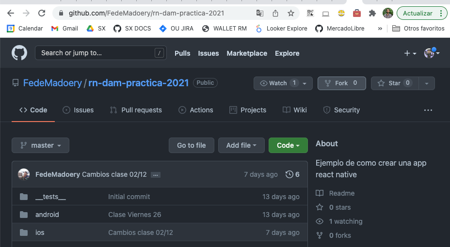

# Trabajo Practico Integrador React Native
> Laboratorio React native
>
> Presentado: _Viernes 10 de Diciembre 2021_
>
> Entrega: TBD

## Introducción

Este trabajo se desarrollará sobre la app que fuimos construyendo en vivo durante las clases de práctica.

Asegurarse de tener configurado el entorno para trabajar con react-native antes de comenzar. [Link a la guía de configuración de entorno](../../general/reactNative.md).

Recordar que la api que estamos utilizando en este trabajo es gratiuta pero utiliza una api key con un limite diario de request permitidas. Durante la clase estuvimos utilizando una sola api key pero, de mantener la misma, es posible que durante el desarrollo se encuentren con que se llegó al limite diario. Para evitar esta situción les recomendamos generar sus propia api key de forma gratuita visitando [https://www.omdbapi.com/](https://www.omdbapi.com/). Dentro de la misma url tambien pueden encontrar la documentación de la api.

## 1 - Forkear el repo de las prácticas

Link del repositorio: [https://github.com/FedeMadoery/rn-dam-practica-2021](https://github.com/FedeMadoery/rn-dam-practica-2021)

Para comenzar a trabajar es necesario contar con una copia del repositorio de practica. La opción de Fork permite realizar una copia de un repositorio ajeno dentro de nuestra cuenta de github y luego poder trabajar sobre el como cualquier otro de nuestros propios repositorios.

Luego de realizar la copia asegurarse de descargar **la version forkeada** y abrirla con VSCODE, Webstorm o su IDE de preferencia de javascript. 

## 2 - Mejora: Agregar/Remover peliculas a favoritos y ver mas tarde

Durante las prácticas implementamos la funcionalidad de agregar peliculas a favoritos o a ver mas tarde. En esta etapa vamos a modificar estas funcionalidades para que funcionen como un toggle. Es decir, si la película no esta en la lista se agrega pero si ya esta presente se elimina.

## 3 - Feature: Pantalla de Home

En el tab de `home` implementar una ui que muestre el listado de películas favoritas y el listado de peliculas para ver mas tarde con cada película como cards.

Mostrar solo un listado por vez utilizando un botón, un switch o tabs para cambiar ente el listado de peliculas favoritas y el listado de ver mas tarde.

## 4 - Feature: Pantalla de Profile

En el tab de `profile` implementar una pantalla que contenga una foto de perfil, el usuario, un correo electrónico (todos estos datos pueden ser estáticos). 

Ademas, deberá mostrar el número de películas agregadas a favoritos y el número agregadas a ver mas tarde.

Finalmente agregaremos un botón `Salir` que al apretarlo cerrará la aplicación.

