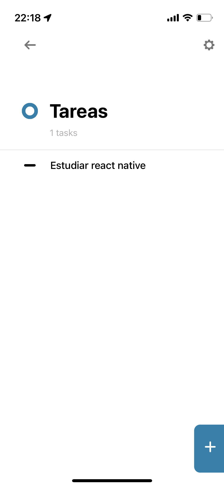
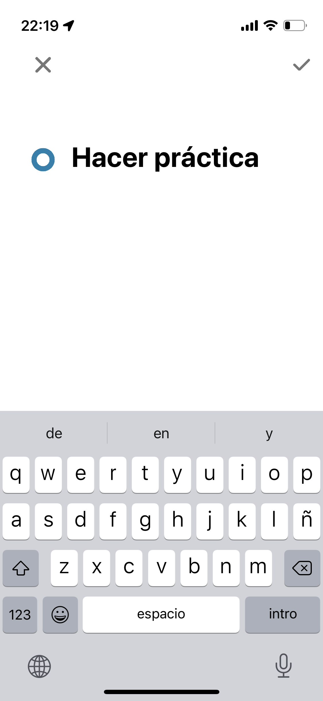
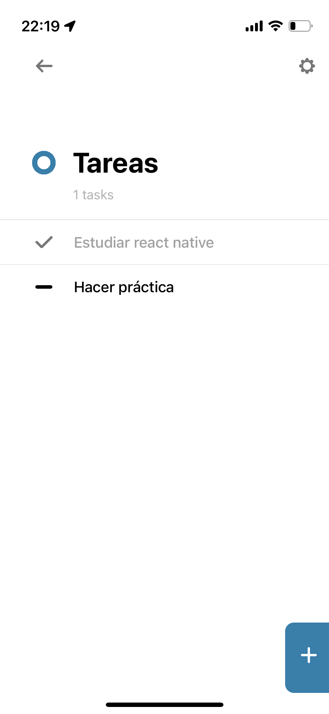

# Práctica React Native

> Asegurarse de tener configurado el entorno para trabajar con react-native antes de comenzar. [Link a la guía de configuración de entorno](../../general/reactNative.md).

Realizaremos una app que nos permita crear una lista de tareas, modicarlas, eliminarlas y marcarlas como completadas.

## Requisitos

- Dos pantallas navegables utilizando [react-navigation](https://reactnavigation.org/docs/getting-started/):
	- Una pantalla con un botón para crear una nueva tarea y el listado de tareas existentes  donde cada item tendrá un checkbox para tildar como completa, un boton para editar y otro para eliminar
	- Otra pantalla para la creación/edicion de las tareas.
- Guardar los recordatorios y su estado utilizando la memoria del telefono con [Async Storage](https://react-native-async-storage.github.io/async-storage/)

A modo de ejemplo adjuntamos algunas imagenes, no es necesario respetar esta misma ui:

| Listado | Cración | Listado con tarea completa |
| --- | --- | --- |
|  |  |  |

> Referencias:
> Helo world de react navigation: [https://reactnavigation.org/docs/hello-react-navigation](https://reactnavigation.org/docs/hello-react-navigation)
> Uso de async storage: [https://react-native-async-storage.github.io/async-storage/docs/usage](https://react-native-async-storage.github.io/async-storage/docs/usage)
