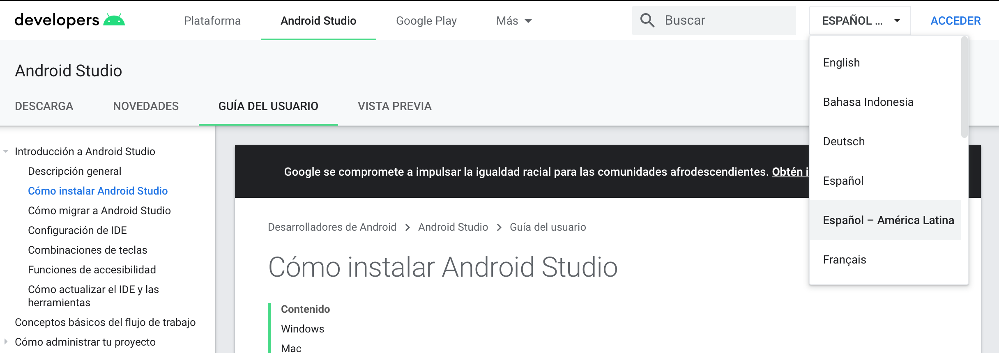

# Instalando Android Studio

Las herramientas para el desarrollo de aplicaciones en el ecosistema de Android se encuentran disponibles para Mac, Windows, Linux e incluso Chromebooks.

## Descargando Android Studio

Android Studio es el entorno de desarrollo gratuito que Google y Jetbrains nos proponen para realizar nuestras apliaciones.

El mismo puede ser descargado desde [su pagina oficial](https://developer.android.com/studio/).
```
https://developer.android.com/studio/
```

Para mas información sobre como realizar la instalación puede referirse a [la siguiente página](https://developer.android.com/studio/install)

```
https://developer.android.com/studio/install
```

Los recursos de la página web de Android pueden visualizarse en diferentes idiomas presionando el desplegable en la esquina superior derecha



## Emulador de Android

El emulador de android depende de tecnologías de virtualización que tienen que estar soportadas por tu CPU y sistema opetativo. En caso de tener problemas tratando de hacer funcionar la aceleración de hardware puede recurrir a [este artículo](https://developer.android.com/studio/run/emulator-acceleration)

```
https://developer.android.com/studio/run/emulator-acceleration
```

## Problemas con la instalación

Si todavía esta teniendo problemas con la instalación no dude en ponerse en contacto con el docente y/o los ayudantes de cátedra.

Además, puede consultar la sección de soporte de [Android](https://developer.android.com/support)

```
https://developer.android.com/support
```


