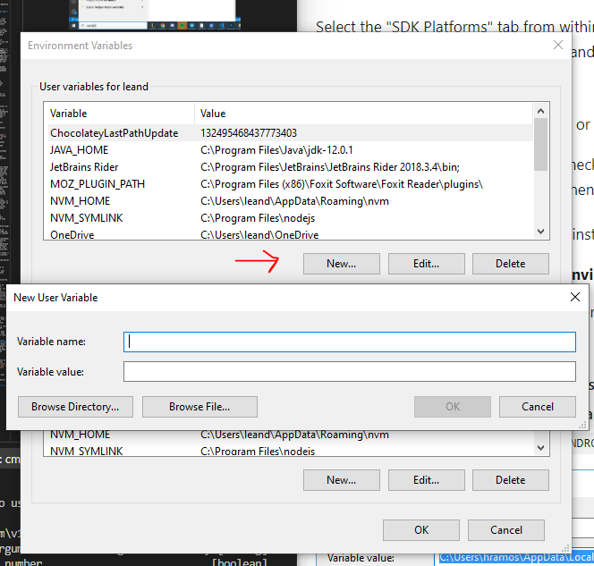
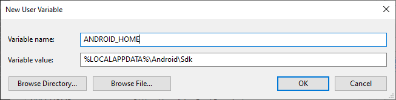

# Preparando nuestro entorno de desarrollo

Para desarrollar aplicaciones con react native necesitaremos contar con las siguientes herramientas instaladas en nuestra pc/mac
* Un editor de texto/IDE compatible (VS Code o Webstorm)
* Node
* OpenJDK 8+
* La variable de entorno ANDROID_HOME configurado correctamente
* Un emulador o simulador. Puede ser Android Studio (Necesario para ejecutar el emulador de android) o XCode (En caso de tener una mac y deseen ejecutar el simulador de iOS)

En caso de no contar con estas herramientas a continuación procederemos con su instalación 

## 1- Instalando Visual Studio Code

Visual studio code es un editor de código gratuito desarrollado por Microsoft el cual se encuentra disponible para Windows, Linux, macOS.

Para descargarlo solo debemos dirigirnos a [https://code.visualstudio.com/](https://code.visualstudio.com/)


Como vs code realmente es un editor de texto para multiples lenguajes y frameworks tambien es conveniente realizar la instalación de la extension de react-native para el mismo

Para esto nos dirigimos a la pestaña de extensiones en el menu izquierdo de la herramienta


En la barra de busqueda tipeamos `React native tools` y seleccionaremos la opcion `install` a la extension publicada por Microsoft


### Instalando Webstorm [OPCIONAL: alternativa a vs code]
Como alternativ a VS Code y en caso de contar con las cuentas educativas de la facutad, también podemos obtener una licencia para  Webstorm, el ide de javascript de jetbrains.

Para acceder al beneficio es necesario contar con el 
[Github Student Developer Pack](https://education.github.com/pack) y luego acceder al sitio de [JetBrains](https://www.jetbrains.com/webstorm/) para la descarga.


## 2- Instalando Node y OpenJDK8+

### Linux
Para installar [nvm](https://github.com/nvm-sh/nvm) abrir una terminal y ejecutar

```
curl -o- https://raw.githubusercontent.com/nvm-sh/nvm/v0.37.0/install.sh | bash
```

Para recargar la terminal actual con nvm podemos ejecutar

```
export NVM_DIR="$([ -z "${XDG_CONFIG_HOME-}" ] && printf %s "${HOME}/.nvm" || printf %s "${XDG_CONFIG_HOME}/nvm")"
[ -s "$NVM_DIR/nvm.sh" ] && \. "$NVM_DIR/nvm.sh" # This loads nvm
```

Luego para comprobar que se haya instalado correctamente podemos ejecutar
```
nvm -v
```

Finalmente para instalar node v12 podemos ejecutar 
```
nvm install 12
```

Y para comprobar su correcta instalación ejecutar
```
node -v
```

Luego para realizar la instalacion de `openjdk` buscar el comando correspondiente a su distribución en [este link](https://openjdk.java.net/install/)

Por ejemplo, para ubuntu es:
```
sudo apt-get install openjdk-8-jre
```
### Mac
Abrir una terminal y ejecutar desde [brew](https://brew.sh/index_es) los siguientes comandos
```
brew install node
```
```
brew install watchman
```
```
brew cask install adoptopenjdk/openjdk/adoptopenjdk8
```
### Windows

Instalar paquetes desde windows no es algo muy sencillo de hacer sin herramientas externas, para simplificarnos la tarea de instalar OpenJDK y Node v12 promonemos en primera instancia realizar la instalación del gestor de paquetes `Chocolatey` que expone una funcionalidad similar a la de los gestores de paquetes que se encuentran en Mac y Linux.

> No es necesario instalar Chocolatey, si desea puede realizar la instalación de los elementos necesarios por cualquier otro metodo.

Para instalar `Chocolatey` es necesario primero ejecutar un CMD como administrador 


Desde dentro de la shell administrador de CMD ejecutar el comando 

```
@"%SystemRoot%\System32\WindowsPowerShell\v1.0\powershell.exe" -NoProfile -InputFormat None -ExecutionPolicy Bypass -Command "iex ((New-Object System.Net.WebClient).DownloadString('https://chocolatey.org/install.ps1'))" && SET "PATH=%PATH%;%ALLUSERSPROFILE%\chocolatey\bin"
```

Luego comenzara la instalación de Chocolatey, la cual puede demorar unos minutos


Cuando finalice la instalación será necesario cerrar las ventanas de CMD actualmente abiertas. Luego, al reabrirlas ya tendremos disponibles el comando `choco` para realizar la instalación de paquetes.

Podemos comprobar su correcta instalación ejecutando
```
choco -v
```

Luego para realizar la instalación de Node y OpenJDk solo es necesario ejecutar
```
choco install -y nodejs.install openjdk8
```
> Recordar que debe ejecutarse CMD como administrador o lanzará error.

## 3 - Configurando la variable ANDROID_HOME
La herramiente React Native tools requiere que la variable de entorno ANDROID_HOME este configurada

### Linux y Mac
Si estas usando bash ejecuta

```
nano ~/.bashrc 
```

> Si usas zsh edita tu `~/.zshrc`

y agrega las siguientes lineas a tu configuración

```
export ANDROID_HOME=$HOME/Library/Android/sdk
export PATH=$PATH:$ANDROID_HOME/emulator
export PATH=$PATH:$ANDROID_HOME/tools
export PATH=$PATH:$ANDROID_HOME/tools/bin
export PATH=$PATH:$ANDROID_HOME/platform-tools
```

Para recargar el bashrc sin salir y volver a loguearse podes ejecutar
```
source ~/.bashrc
``` 
> Si usas zsh reemplaza por `~/.zshrc`
### Windows
Buscar en el menu de windows la opcion `Editar las variables de entorno` o `Edit the system environment variables`


Apretamos `New` en la opcion de user variables 



Agregamos la variables `ANDROID_HOME` con los valores

Variable Name
```
ANDROID_HOME
```

Variable Value
```
%LOCALAPPDATA%\Android\Sdk
```



Luego presionamos `OK` y deberiamos ver nuestra nueva variable agregada

Finalmente, es necesario agregar `platform-tools` a la variable `Path` que ya deberia existir entre nuestras variables de usuario (Si no existe crearla)

Para esto la buscamos y seleccionamos `Edit`


Y agregamos la dirección 
```
%LOCALAPPDATA%\Android\Sdk\platform-tools
```


Finalmente presionamos `OK`

## 4 - Probando que todo funcione! 

Si queres comprobar que todo funcione correctamente podes crear un proyecto de react-native de prueba con: 
```
npx react-native init MiProyectoCopado
```

En caso de haber tenido problemas durante la instalación dejanos una pregunta en Teams o por correo o la guia de react-native en (https://reactnative.dev/docs/environment-setup)[https://reactnative.dev/docs/environment-setup]


